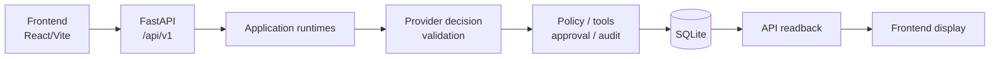

# Enterprise AI Tool Gateway

## 1. Что это

Enterprise AI Tool Gateway — это локальный/demo-прототип контролируемого выполнения инструментов LLM для синтетических enterprise workflows: модель предлагает structured decisions, backend валидирует их, tools выполняются только через controlled backend boundaries, approval ограничивает risky actions, audit фиксирует lifecycle evidence, а web UI отображает controlled lifecycle через `/api/v1`.

Это не chatbot, не автономное прямое использование tools со стороны LLM и не production SaaS platform.

## 2. Что это демонстрирует

* Controlled gateway lifecycle от workflow submission до final run status.
* Синтетические enterprise workflows для access, procurement и maintenance.
* FastAPI backend с версионированными endpoints `/api/v1`.
* React/Vite frontend как локальная web console поверх API.
* Deterministic eval suite для backend/API acceptance behavior.
* Public redaction/projection boundary для run, tool, approval и audit data.

## 3. Архитектура в общих чертах



Backend владеет workflow decisions. Frontend отправляет demo requests, resolves approvals через API и отображает backend-controlled readback.

## 4. Текущие возможности

Реализованные capabilities:

* `ACCESS_REQUEST`;
* `PROCUREMENT_REQUEST`;
* `MAINTENANCE_REQUEST`;
* approval flow для risky state-changing draft actions;
* run detail и run-scoped readback;
* registered tool calls с safe public projection;
* audit trail для lifecycle events;
* deterministic eval runner;
* local web console.

## 5. Quickstart

Быстрый demo runner для Windows:

```text
run_demo.cmd
```

Runner запускает локальные backend и frontend, открывает dashboard и оставляет одно управляющее PowerShell window открытым. Manual commands ниже остаются доступны, когда нужны отдельные терминалы.

Запустить backend из корня repository:

```bash
uv run uvicorn enterprise_ai_tool_gateway.api.http.app:app --reload
```

Запустить frontend во втором терминале:

```bash
cd frontend
npm install
npm run dev -- --host 127.0.0.1 --port 5173
```

Открыть:

```text
http://127.0.0.1:5173/dashboard
http://127.0.0.1:8000/api/v1/health
http://127.0.0.1:8000/api/v1/capabilities
```

Backend root `/` может возвращать 404. Это нормально: backend обслуживает версионированный API, а frontend обслуживается через Vite.

## 6. Validation

Backend validation:

```bash
uv run pytest
uv run ruff check .
uv run pyright
uv run python scripts/run_eval.py
uv run python scripts/run_eval.py --format json
```

Frontend validation:

```bash
cd frontend
npm run typecheck
npm run build
```

Default validation использует deterministic mock/static provider paths. Real provider credentials не требуются.

## 7. Demo walkthrough

Используйте [docs/DEMO_WALKTHROUGH.md](docs/DEMO_WALKTHROUGH.md) для guided local demo. Он покрывает Access happy path, Procurement approval path, Maintenance default/safe path, Run Detail, Tool Calls, Audit Trail и eval runner.

## 8. Карта документации

* [docs/PROJECT_CONTEXT.md](docs/PROJECT_CONTEXT.md) - current prototype scope,
  implemented workflows, safety status и intentional non-goals.
* [docs/ARCHITECTURE.md](docs/ARCHITECTURE.md) - system architecture, request
  lifecycle, tool boundary, approval boundary, audit/redaction model и
  limitations.
* [docs/PROJECT_MAP.md](docs/PROJECT_MAP.md) - repository structure, package
  ownership, entrypoints и boundary rules.
* [docs/API_AND_EVALS.md](docs/API_AND_EVALS.md) - public API surface,
  controlled outcomes, redaction behavior и deterministic eval suite.
* [docs/DEMO_WALKTHROUGH.md](docs/DEMO_WALKTHROUGH.md) - step-by-step local
  demo scenarios для backend и frontend.
* [docs/DEVELOPMENT_GUIDE.md](docs/DEVELOPMENT_GUIDE.md) - local setup,
  validation commands, smoke checks и safe development workflow.

## 9. Известные ограничения

* Только local/demo.
* Mock provider path по умолчанию.
* Synthetic workflow data.
* Нет authentication, RBAC или tenants.
* Нет real enterprise connectors.
* Нет provider/model selection.
* Нет deployment, hosting или payment support.
* Нет production security hardening.
* Frontend использует browser-local known-run index, а не global backend listing.

## 10. Статус

Этот repository представляет текущий frozen local/demo prototype. Реализация feature-complete для documented demo scope, а future ideas должны рассматриваться как backlog, а не implemented capabilities.

Используйте public docs в `docs/` как текущий source of truth.
