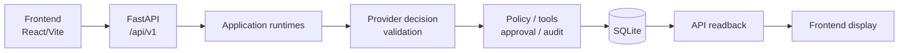

# Enterprise AI Tool Gateway

## 1. What this is

Enterprise AI Tool Gateway is a local/demo prototype of controlled LLM tool
execution for synthetic enterprise workflows: the model proposes structured
decisions, the backend validates them, tools execute only through controlled
backend boundaries, approval gates risky actions, audit records lifecycle
evidence, and the web UI displays the controlled lifecycle through `/api/v1`.

This is not a chatbot, not autonomous direct tool use by an LLM, and not a
production SaaS platform.

## 2. What this demonstrates

* Controlled gateway lifecycle from workflow submission to final run status.
* Synthetic enterprise workflows for access, procurement and maintenance.
* FastAPI backend with versioned `/api/v1` endpoints.
* React/Vite frontend as a local web console over the API.
* Deterministic eval suite for backend/API acceptance behavior.
* Public redaction/projection boundary for run, tool, approval and audit data.

## 3. Architecture at a glance



The backend owns workflow decisions. The frontend submits demo requests,
resolves approvals through the API and displays backend-controlled readback.

## 4. Current capabilities

Implemented capabilities:

* `ACCESS_REQUEST`;
* `PROCUREMENT_REQUEST`;
* `MAINTENANCE_REQUEST`;
* approval flow for risky state-changing draft actions;
* run detail and run-scoped readback;
* registered tool calls with safe public projection;
* audit trail for lifecycle events;
* deterministic eval runner;
* local web console.

## 5. Quickstart

Quick demo runner for Windows:

```text
run_demo.cmd
```

The runner starts the local backend and frontend, opens the dashboard and keeps
one controlling PowerShell window open. The manual commands below remain
available when you want separate terminals.

Start the backend from the repository root:

```bash
uv run uvicorn enterprise_ai_tool_gateway.api.http.app:app --reload
```

Start the frontend in a second terminal:

```bash
cd frontend
npm install
npm run dev -- --host 127.0.0.1 --port 5173
```

Open:

```text
http://127.0.0.1:5173/dashboard
http://127.0.0.1:8000/api/v1/health
http://127.0.0.1:8000/api/v1/capabilities
```

The backend root `/` may return 404. That is normal; the backend serves the
versioned API, while the frontend is served by Vite.

## 6. Validation

Backend validation:

```bash
uv run pytest
uv run ruff check .
uv run pyright
uv run python scripts/run_eval.py
uv run python scripts/run_eval.py --format json
```

Frontend validation:

```bash
cd frontend
npm run typecheck
npm run build
```

Default validation uses deterministic mock/static provider paths. No real
provider credentials are required.

## 7. Demo walkthrough

Use [docs/DEMO_WALKTHROUGH.md](docs/DEMO_WALKTHROUGH.md) for the guided local
demo. It covers the Access happy path, Procurement approval path, Maintenance
default/safe path, Run Detail, Tool Calls, Audit Trail and the eval runner.

## 8. Documentation map

* [docs/PROJECT_CONTEXT.md](docs/PROJECT_CONTEXT.md) - current prototype scope,
  implemented workflows, safety status and intentional non-goals.
* [docs/ARCHITECTURE.md](docs/ARCHITECTURE.md) - system architecture, request
  lifecycle, tool boundary, approval boundary, audit/redaction model and
  limitations.
* [docs/PROJECT_MAP.md](docs/PROJECT_MAP.md) - repository structure, package
  ownership, entrypoints and boundary rules.
* [docs/API_AND_EVALS.md](docs/API_AND_EVALS.md) - public API surface,
  controlled outcomes, redaction behavior and deterministic eval suite.
* [docs/DEMO_WALKTHROUGH.md](docs/DEMO_WALKTHROUGH.md) - step-by-step local
  demo scenarios for the backend and frontend.
* [docs/DEVELOPMENT_GUIDE.md](docs/DEVELOPMENT_GUIDE.md) - local setup,
  validation commands, smoke checks and safe development workflow.

## 9. Known limitations

* Local/demo only.
* Mock provider path by default.
* Synthetic workflow data.
* No authentication, RBAC or tenants.
* No real enterprise connectors.
* No provider/model selection.
* No deployment, hosting or payment support.
* No production security hardening.
* Frontend uses a browser-local known-run index, not a global backend listing.

## 10. Status

This repository represents the current frozen local/demo prototype. The
implementation is feature-complete for the documented demo scope, and future
ideas should be treated as backlog rather than implemented capabilities.

Use the public docs in `docs/` as the current source of truth.
