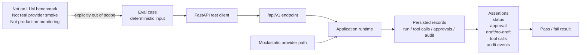

# API and Evals

## 1. Purpose

The API is the local/demo acceptance surface for the controlled LLM
tool-execution gateway. It accepts synthetic workflow requests, delegates
orchestration to backend application runtimes, exposes controlled run outcomes,
and provides run-scoped readback for tool calls, approvals and audit events.

The eval suite verifies that this gateway lifecycle behaves deterministically
through the public API. It is acceptance verification for backend control
behavior, not an LLM benchmark, provider quality benchmark, production monitor
or real external-service test.

## 2. API design principles

* `/api/v1` is a local/demo API surface.
* API routes are inbound adapters. They map request DTOs, call application
  runtimes or repository read methods, and return public response DTOs.
* Application runtimes own workflow orchestration, including provider calls,
  backend validation, tool execution, policy checks, approvals, persistence and
  audit events.
* Business outcomes are controlled gateway statuses on the run. A valid API
  request can return HTTP 200 with a controlled stop such as `REJECTED`,
  `NEEDS_MANUAL_REVIEW` or `FAILED_VALIDATION`.
* The default provider mode is deterministic `mock`.
* Provider/model selection is disabled. Workflow submit DTOs reject unexpected
  provider/model selection fields.

## 3. Capabilities and health

| Method | Path | Purpose |
| --- | --- | --- |
| `GET` | `/api/v1/health` | Returns local API health. |
| `GET` | `/api/v1/capabilities` | Returns the implemented demo workflow and provider capability metadata. |

`GET /api/v1/health` returns:

```json
{"status": "ok"}
```

`GET /api/v1/capabilities` exposes:

| Field | Current value |
| --- | --- |
| `workflows` | `ACCESS_REQUEST`, `PROCUREMENT_REQUEST`, `MAINTENANCE_REQUEST` |
| `approval_modes` | `AUTO_APPROVE`, `HIGH_RISK_ONLY`, `ALWAYS_REQUIRE` |
| `provider_mode` | `mock` |
| `model_selection.enabled` | `false` |
| `model_selection.active_profile` | `mock` |
| `model_selection.available_profiles` | `["mock"]` |

The capabilities response intentionally does not advertise GigaChat,
OpenRouter, YandexGPT or a provider marketplace as selectable API options.

## 4. Workflow submit endpoints

All workflow submit endpoints return a `WorkflowResultResponse` containing:

* `run`;
* `final_summary`;
* `requires_approval`;
* `approval`;
* `tool_calls`;
* `audit_events`.

| Method | Path | Purpose | Expected controlled outcomes | Demonstrates |
| --- | --- | --- | --- | --- |
| `POST` | `/api/v1/access-requests` | Submit a synthetic access-control request. | `COMPLETED`, `WAITING_FOR_APPROVAL`, `NEEDS_USER_INPUT`, `NEEDS_MANUAL_REVIEW`, `REJECTED`, `FAILED_VALIDATION`, provider/tool failures when boundaries fail safely. | Employee/system/access-policy checks, backend tool validation, policy gating and high-risk access approval. |
| `POST` | `/api/v1/procurement-requests` | Submit a synthetic spend/vendor/budget request. | `COMPLETED`, `WAITING_FOR_APPROVAL`, `NEEDS_USER_INPUT`, `NEEDS_MANUAL_REVIEW`, `REJECTED`, `FAILED_VALIDATION`, provider/tool failures when boundaries fail safely. | Requester/vendor/catalog/budget/duplicate checks, draft purchase request control and approval for higher-risk spend. |
| `POST` | `/api/v1/maintenance-requests` | Submit a synthetic maintenance-lite request. | `COMPLETED`, `WAITING_FOR_APPROVAL`, `NEEDS_USER_INPUT`, `NEEDS_MANUAL_REVIEW`, `REJECTED`, `FAILED_VALIDATION`, provider/tool failures when boundaries fail safely. | Requester/asset/severity/safety checks, canonical maintenance severity validation, draft work order control and high-severity approval. |

Compact access submit shape:

```json
{
  "user_id": "user-1",
  "request_text": "Need access to CRM.",
  "employee_id": "emp-001",
  "system_id": "crm",
  "access_level": "READ",
  "duration_days": 30,
  "approval_mode": "HIGH_RISK_ONLY"
}
```

The current submit schemas are workflow-specific. They do not accept `provider`,
`model` or similar model-selection fields.

## 5. Approval endpoint

| Method | Path | Purpose |
| --- | --- | --- |
| `POST` | `/api/v1/approvals/{approval_id}/resolve` | Resolve a pending approval for a run waiting on approval. |

Request body:

```json
{
  "run_id": "<run uuid>",
  "status": "APPROVED",
  "decided_by": "manager-001",
  "decision_comment": "Approved for demo."
}
```

Supported terminal decisions:

| Decision | Effect |
| --- | --- |
| `APPROVED` | Resumes the waiting run and executes the waiting state-changing draft tool through the authorized backend tool boundary. |
| `REJECTED` | Rejects the run and does not create a draft. |
| `CANCELLED` | Rejects the run and does not create a draft. |

`PENDING` is not a decision. The request schema rejects it with HTTP 422.

When a required approval exists, the draft action does not run and no draft
output is produced before approval resolution. A rejected or cancelled approval
does not create a draft. Resolving an already terminal approval returns a state
conflict.

The current approval policy includes an `AUTO_APPROVE` safety floor:
`AUTO_APPROVE` does not bypass high-risk, critical-risk or default-approval
state-changing controls. High-risk/default-approval state-changing actions
still require approval, and critical-risk actions move to manual review.

## 6. Run read endpoints

| Method | Path | Purpose |
| --- | --- | --- |
| `GET` | `/api/v1/runs/{run_id}` | Read run detail plus related approvals, tool calls and audit events. |
| `GET` | `/api/v1/runs/{run_id}/tool-calls` | Read tool calls for one run. |
| `GET` | `/api/v1/runs/{run_id}/approvals` | Read approvals for one run. |
| `GET` | `/api/v1/runs/{run_id}/audit-events` | Read audit events for one run. |

Read visibility is run-scoped. The backend currently exposes no global run
listing, no global approval queue and no global audit search. The frontend
known-run index is a browser-local convenience for the demo session. It is not
backend truth and does not replace persisted run-scoped records.

Unknown run IDs return HTTP 404 on run detail and related-record endpoints.

## 7. Controlled outcomes vs HTTP errors

Controlled statuses are backend-owned gateway outcomes. They describe what the
gateway decided after receiving and processing a valid request.

| Run status | Meaning |
| --- | --- |
| `COMPLETED` | The run reached an accepted final state, usually with a synthetic draft output. |
| `WAITING_FOR_APPROVAL` | A required approval is pending and the draft action has not executed. |
| `NEEDS_USER_INPUT` | Required request fields or clarifications are missing. |
| `NEEDS_MANUAL_REVIEW` | Policy or synthetic data checks require manual review. |
| `REJECTED` | Policy or approval rejected the run. |
| `FAILED_VALIDATION` | Provider output, request type, domain template or proposed tool names failed backend validation. |
| `FAILED_TOOL` | A tool boundary or draft action failed safely. |
| `FAILED_PROVIDER` | The provider boundary failed safely. |

These statuses can be returned with HTTP 200 when the API request itself was
well-formed and the gateway processed it successfully.

HTTP errors are reserved for API-level failures:

| HTTP status | Use |
| --- | --- |
| `422` | Malformed or invalid API request body, including forbidden extra fields or `PENDING` as an approval decision. |
| `404` | Missing run or approval. |
| `409` | State conflict, such as mismatched run/approval, non-waiting run or repeated approval resolution. |
| `500` | Unexpected internal API error with a generic safe message. |

## 8. Public projection and redaction

Public API responses use safe projection over internal records:

* tool input and output payloads are passed through public redaction before API
  responses;
* approval free-text fields such as `summary`, `reason`, `decided_by` and
  `decision_comment` are passed through redaction before API responses;
* audit event payloads are created with recursive redaction before persistence
  and are then exposed as run-scoped audit payloads;
* redaction covers sensitive keys and high-confidence sensitive-looking values,
  including token, password, secret, API key and authorization markers;
* persisted records may contain internal details that public DTOs do not expose
  directly;
* redaction is marker-based and value-pattern based. It is not a full security,
  privacy, DLP or classification product.

## 9. Eval runner purpose

`scripts/run_eval.py` runs the deterministic API acceptance suite. It creates an
in-process FastAPI app per case, uses isolated temporary SQLite databases,
installs deterministic mock/static provider behavior and exercises the public
API endpoints.

The eval runner verifies gateway lifecycle behavior:

* submit endpoints return expected controlled statuses;
* approval-required cases do not create a draft before approval;
* approval resolution reaches the expected final status;
* repeated approval resolution conflicts;
* run-scoped read endpoints return consistent related records;
* expected audit events and reason codes are present;
* final summaries are present and avoid obvious unsafe terms;
* failed-validation cases do not persist tool calls.

It performs no real provider calls, no network calls and no real enterprise
connector calls.



## 10. Acceptance matrix

The current deterministic suite contains 21 cases.

| Workflow | Case ID | Initial status | Approval decision | Final status | Focus |
| --- | --- | --- | --- | --- | --- |
| Access | `access_completed` | `COMPLETED` | None | `COMPLETED` | Standard access request creates a synthetic draft. |
| Access | `access_approval_approved` | `WAITING_FOR_APPROVAL` | `APPROVED` | `COMPLETED` | High-risk access waits, then completes after approval. |
| Access | `access_approval_rejected` | `WAITING_FOR_APPROVAL` | `REJECTED` | `REJECTED` | High-risk access rejects after denial. |
| Access | `access_missing_input` | `NEEDS_USER_INPUT` | None | `NEEDS_USER_INPUT` | Missing employee/duration input stops for user input. |
| Access | `access_manual_review_unknown_system` | `NEEDS_MANUAL_REVIEW` | None | `NEEDS_MANUAL_REVIEW` | Unknown system stops for manual review. |
| Access | `access_rejected_forbidden` | `REJECTED` | None | `REJECTED` | Forbidden intern admin access rejects without draft. |
| Access | `access_failed_validation_unknown_tool` | `FAILED_VALIDATION` | None | `FAILED_VALIDATION` | Unknown access tool proposal fails backend validation. |
| Procurement | `procurement_completed` | `COMPLETED` | None | `COMPLETED` | Standard procurement request creates a synthetic draft. |
| Procurement | `procurement_approval_approved` | `WAITING_FOR_APPROVAL` | `APPROVED` | `COMPLETED` | High-value procurement waits, then completes after approval. |
| Procurement | `procurement_approval_rejected` | `WAITING_FOR_APPROVAL` | `REJECTED` | `REJECTED` | High-value procurement rejects after denial. |
| Procurement | `procurement_missing_input` | `NEEDS_USER_INPUT` | None | `NEEDS_USER_INPUT` | Missing requester/item/quantity input stops for user input. |
| Procurement | `procurement_manual_review_total_mismatch_or_budget` | `NEEDS_MANUAL_REVIEW` | None | `NEEDS_MANUAL_REVIEW` | Total mismatch or budget issue stops for manual review. |
| Procurement | `procurement_rejected_blocked_vendor_or_restricted_item` | `REJECTED` | None | `REJECTED` | Blocked vendor or restricted item rejects without draft. |
| Procurement | `procurement_failed_validation_unknown_tool` | `FAILED_VALIDATION` | None | `FAILED_VALIDATION` | Unknown procurement tool proposal fails backend validation. |
| Maintenance | `maintenance_completed` | `COMPLETED` | None | `COMPLETED` | Standard maintenance request creates a synthetic draft. |
| Maintenance | `maintenance_approval_approved` | `WAITING_FOR_APPROVAL` | `APPROVED` | `COMPLETED` | High-severity maintenance waits, then completes after approval. |
| Maintenance | `maintenance_approval_rejected` | `WAITING_FOR_APPROVAL` | `REJECTED` | `REJECTED` | High-severity maintenance rejects after denial. |
| Maintenance | `maintenance_missing_input` | `NEEDS_USER_INPUT` | None | `NEEDS_USER_INPUT` | Missing requester/asset input stops for user input. |
| Maintenance | `maintenance_manual_review_safety_or_critical_asset` | `NEEDS_MANUAL_REVIEW` | None | `NEEDS_MANUAL_REVIEW` | Safety or critical asset concern stops for manual review. |
| Maintenance | `maintenance_rejected_forbidden` | `REJECTED` | None | `REJECTED` | Forbidden maintenance instruction rejects without draft. |
| Maintenance | `maintenance_failed_validation_unknown_tool` | `FAILED_VALIDATION` | None | `FAILED_VALIDATION` | Unknown maintenance tool proposal fails backend validation. |

## 11. Running validation

Run the deterministic eval suite:

```bash
uv run python scripts/run_eval.py
uv run python scripts/run_eval.py --format json
```

Run broader backend validation:

```bash
uv run pytest
uv run ruff check .
uv run pyright
git diff --check
```

Frontend validation is separate from the Python backend suite. When frontend
changes are in scope, run:

```bash
cd frontend
npm run typecheck
npm run build
```

## 12. What evals do not prove

The eval suite does not prove:

* production security;
* real provider quality;
* real enterprise connector behavior;
* authentication, RBAC or tenant behavior;
* scalability or load behavior;
* full UI end-to-end coverage;
* model benchmark performance;
* production monitoring readiness.

## 13. Related documents

Related documents:

* [PROJECT_CONTEXT.md](PROJECT_CONTEXT.md) - current prototype scope,
  implemented workflows, API status, frontend status and intentional non-goals.
* [ARCHITECTURE.md](ARCHITECTURE.md) - system architecture, request lifecycle,
  boundaries, approval model, failure model and limitations.
* [PROJECT_MAP.md](PROJECT_MAP.md) - repository structure, package ownership,
  API/eval entrypoints and validation map.
* [DEMO_WALKTHROUGH.md](DEMO_WALKTHROUGH.md) - local demo walkthrough for the
  backend, frontend and eval runner.
* [DEVELOPMENT_GUIDE.md](DEVELOPMENT_GUIDE.md) - setup, validation and safe
  development workflow.
