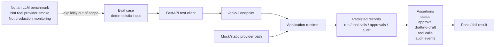

# API и Evals

## 1. Назначение

API — это локальная/demo acceptance surface для шлюза контролируемого выполнения инструментов LLM. Он принимает synthetic workflow requests, делегирует orchestration backend application runtimes, раскрывает controlled run outcomes и предоставляет run-scoped readback для tool calls, approvals и audit events.

Eval suite проверяет, что этот gateway lifecycle ведёт себя детерминированно через public API. Это acceptance verification для backend control behavior, а не LLM benchmark, benchmark качества provider, production monitor или тест реального external service.

## 2. Принципы проектирования API

* `/api/v1` — это локальная/demo API surface.
* API routes являются inbound adapters. Они выполняют mapping request DTOs, вызывают application runtimes или repository read methods и возвращают public response DTOs.
* Application runtimes владеют workflow orchestration, включая provider calls, backend validation, tool execution, policy checks, approvals, persistence и audit events.
* Business outcomes являются controlled gateway statuses на run. Валидный API request может вернуть HTTP 200 с controlled stop, например `REJECTED`, `NEEDS_MANUAL_REVIEW` или `FAILED_VALIDATION`.
* Default provider mode — детерминированный `mock`.
* Provider/model selection отключён. Workflow submit DTOs отклоняют неожиданные provider/model selection fields.

## 3. Capabilities и health

| Method | Path                   | Назначение                                                               |
| ------ | ---------------------- | ------------------------------------------------------------------------ |
| `GET`  | `/api/v1/health`       | Возвращает local API health.                                             |
| `GET`  | `/api/v1/capabilities` | Возвращает metadata реализованных demo workflow и provider capabilities. |

`GET /api/v1/health` возвращает:

```json
{"status": "ok"}
```

`GET /api/v1/capabilities` раскрывает:

| Field                                | Текущее значение                                               |
| ------------------------------------ | -------------------------------------------------------------- |
| `workflows`                          | `ACCESS_REQUEST`, `PROCUREMENT_REQUEST`, `MAINTENANCE_REQUEST` |
| `approval_modes`                     | `AUTO_APPROVE`, `HIGH_RISK_ONLY`, `ALWAYS_REQUIRE`             |
| `provider_mode`                      | `mock`                                                         |
| `model_selection.enabled`            | `false`                                                        |
| `model_selection.active_profile`     | `mock`                                                         |
| `model_selection.available_profiles` | `["mock"]`                                                     |

Capabilities response намеренно не рекламирует GigaChat, OpenRouter, YandexGPT или provider marketplace как selectable API options.

## 4. Workflow submit endpoints

Все workflow submit endpoints возвращают `WorkflowResultResponse`, содержащий:

* `run`;
* `final_summary`;
* `requires_approval`;
* `approval`;
* `tool_calls`;
* `audit_events`.

| Method | Path                           | Назначение                                       | Ожидаемые controlled outcomes                                                                                                                                                              | Демонстрирует                                                                                                                         |
| ------ | ------------------------------ | ------------------------------------------------ | ------------------------------------------------------------------------------------------------------------------------------------------------------------------------------------------ | ------------------------------------------------------------------------------------------------------------------------------------- |
| `POST` | `/api/v1/access-requests`      | Отправить synthetic access-control request.      | `COMPLETED`, `WAITING_FOR_APPROVAL`, `NEEDS_USER_INPUT`, `NEEDS_MANUAL_REVIEW`, `REJECTED`, `FAILED_VALIDATION`, provider/tool failures, когда boundaries безопасно завершаются с ошибкой. | Employee/system/access-policy checks, backend tool validation, policy gating и high-risk access approval.                             |
| `POST` | `/api/v1/procurement-requests` | Отправить synthetic spend/vendor/budget request. | `COMPLETED`, `WAITING_FOR_APPROVAL`, `NEEDS_USER_INPUT`, `NEEDS_MANUAL_REVIEW`, `REJECTED`, `FAILED_VALIDATION`, provider/tool failures, когда boundaries безопасно завершаются с ошибкой. | Requester/vendor/catalog/budget/duplicate checks, draft purchase request control и approval для higher-risk spend.                    |
| `POST` | `/api/v1/maintenance-requests` | Отправить synthetic maintenance-lite request.    | `COMPLETED`, `WAITING_FOR_APPROVAL`, `NEEDS_USER_INPUT`, `NEEDS_MANUAL_REVIEW`, `REJECTED`, `FAILED_VALIDATION`, provider/tool failures, когда boundaries безопасно завершаются с ошибкой. | Requester/asset/severity/safety checks, canonical maintenance severity validation, draft work order control и high-severity approval. |

Compact access submit shape:

```json
{
  "user_id": "user-1",
  "request_text": "Need access to CRM.",
  "employee_id": "emp-001",
  "system_id": "crm",
  "access_level": "READ",
  "duration_days": 30,
  "approval_mode": "HIGH_RISK_ONLY"
}
```

Текущие submit schemas являются workflow-specific. Они не принимают `provider`, `model` или похожие model-selection fields.

## 5. Approval endpoint

| Method | Path                                      | Назначение                                             |
| ------ | ----------------------------------------- | ------------------------------------------------------ |
| `POST` | `/api/v1/approvals/{approval_id}/resolve` | Resolve pending approval для run, ожидающего approval. |

Request body:

```json
{
  "run_id": "<run uuid>",
  "status": "APPROVED",
  "decided_by": "manager-001",
  "decision_comment": "Approved for demo."
}
```

Поддерживаемые terminal decisions:

| Decision    | Effect                                                                                                         |
| ----------- | -------------------------------------------------------------------------------------------------------------- |
| `APPROVED`  | Возобновляет waiting run и выполняет waiting state-changing draft tool через authorized backend tool boundary. |
| `REJECTED`  | Отклоняет run и не создаёт draft.                                                                              |
| `CANCELLED` | Отклоняет run и не создаёт draft.                                                                              |

`PENDING` не является decision. Request schema отклоняет его с HTTP 422.

Когда существует required approval, draft action не запускается и draft output не создаётся до approval resolution. Rejected или cancelled approval не создаёт draft. Resolve approval, который уже terminal, возвращает state conflict.

Текущая approval policy включает `AUTO_APPROVE` safety floor: `AUTO_APPROVE` не обходит high-risk, critical-risk или default-approval state-changing controls. High-risk/default-approval state-changing actions всё равно требуют approval, а critical-risk actions переводятся в manual review.

## 6. Run read endpoints

| Method | Path                                 | Назначение                                                                  |
| ------ | ------------------------------------ | --------------------------------------------------------------------------- |
| `GET`  | `/api/v1/runs/{run_id}`              | Прочитать run detail вместе с related approvals, tool calls и audit events. |
| `GET`  | `/api/v1/runs/{run_id}/tool-calls`   | Прочитать tool calls для одного run.                                        |
| `GET`  | `/api/v1/runs/{run_id}/approvals`    | Прочитать approvals для одного run.                                         |
| `GET`  | `/api/v1/runs/{run_id}/audit-events` | Прочитать audit events для одного run.                                      |

Read visibility является run-scoped. Backend сейчас не раскрывает global run listing, global approval queue и global audit search. Frontend known-run index — это browser-local convenience для demo session. Он не является backend truth и не заменяет persisted run-scoped records.

Unknown run IDs возвращают HTTP 404 на run detail и related-record endpoints.

## 7. Controlled outcomes vs HTTP errors

Controlled statuses — это gateway outcomes, принадлежащие backend. Они описывают, что решил gateway после получения и обработки валидного request.

| Run status             | Значение                                                                                             |
| ---------------------- | ---------------------------------------------------------------------------------------------------- |
| `COMPLETED`            | Run достиг принятого final state, обычно с synthetic draft output.                                   |
| `WAITING_FOR_APPROVAL` | Required approval находится в pending, а draft action ещё не выполнен.                               |
| `NEEDS_USER_INPUT`     | Отсутствуют обязательные request fields или clarifications.                                          |
| `NEEDS_MANUAL_REVIEW`  | Policy или synthetic data checks требуют manual review.                                              |
| `REJECTED`             | Policy или approval отклонили run.                                                                   |
| `FAILED_VALIDATION`    | Provider output, request type, domain template или proposed tool names не прошли backend validation. |
| `FAILED_TOOL`          | Tool boundary или draft action безопасно завершились с ошибкой.                                      |
| `FAILED_PROVIDER`      | Provider boundary безопасно завершился с ошибкой.                                                    |

Эти statuses могут возвращаться с HTTP 200, когда сам API request был well-formed и gateway успешно его обработал.

HTTP errors зарезервированы для API-level failures:

| HTTP status | Использование                                                                                               |
| ----------- | ----------------------------------------------------------------------------------------------------------- |
| `422`       | Malformed или invalid API request body, включая forbidden extra fields или `PENDING` как approval decision. |
| `404`       | Missing run или approval.                                                                                   |
| `409`       | State conflict, например mismatched run/approval, non-waiting run или repeated approval resolution.         |
| `500`       | Unexpected internal API error с generic safe message.                                                       |

## 8. Public projection и redaction

Public API responses используют safe projection поверх internal records:

* tool input и output payloads проходят public redaction перед API responses;
* approval free-text fields, такие как `summary`, `reason`, `decided_by` и `decision_comment`, проходят redaction перед API responses;
* audit event payloads создаются с recursive redaction до persistence и затем раскрываются как run-scoped audit payloads;
* redaction покрывает sensitive keys и high-confidence sensitive-looking values, включая markers для token, password, secret, API key и authorization;
* persisted records могут содержать internal details, которые public DTOs напрямую не раскрывают;
* redaction основан на markers и value patterns. Это не полноценный security, privacy, DLP или classification product.

## 9. Назначение eval runner

`scripts/run_eval.py` запускает deterministic API acceptance suite. Он создаёт in-process FastAPI app для каждого case, использует isolated temporary SQLite databases, устанавливает deterministic mock/static provider behavior и проверяет public API endpoints.

Eval runner проверяет gateway lifecycle behavior:

* submit endpoints возвращают expected controlled statuses;
* approval-required cases не создают draft до approval;
* approval resolution достигает expected final status;
* repeated approval resolution даёт conflict;
* run-scoped read endpoints возвращают consistent related records;
* expected audit events и reason codes присутствуют;
* final summaries присутствуют и избегают очевидных unsafe terms;
* failed-validation cases не сохраняют tool calls.

Он не выполняет real provider calls, network calls и real enterprise connector calls.



## 10. Acceptance matrix

Текущий deterministic suite содержит 21 case.

| Workflow    | Case ID                                                  | Initial status         | Approval decision | Final status          | Focus                                                                       |
| ----------- | -------------------------------------------------------- | ---------------------- | ----------------- | --------------------- | --------------------------------------------------------------------------- |
| Access      | `access_completed`                                       | `COMPLETED`            | None              | `COMPLETED`           | Standard access request создаёт synthetic draft.                            |
| Access      | `access_approval_approved`                               | `WAITING_FOR_APPROVAL` | `APPROVED`        | `COMPLETED`           | High-risk access ожидает, затем завершается после approval.                 |
| Access      | `access_approval_rejected`                               | `WAITING_FOR_APPROVAL` | `REJECTED`        | `REJECTED`            | High-risk access отклоняется после denial.                                  |
| Access      | `access_missing_input`                                   | `NEEDS_USER_INPUT`     | None              | `NEEDS_USER_INPUT`    | Missing employee/duration input останавливает процесс для user input.       |
| Access      | `access_manual_review_unknown_system`                    | `NEEDS_MANUAL_REVIEW`  | None              | `NEEDS_MANUAL_REVIEW` | Unknown system останавливает процесс для manual review.                     |
| Access      | `access_rejected_forbidden`                              | `REJECTED`             | None              | `REJECTED`            | Forbidden intern admin access отклоняется без draft.                        |
| Access      | `access_failed_validation_unknown_tool`                  | `FAILED_VALIDATION`    | None              | `FAILED_VALIDATION`   | Unknown access tool proposal не проходит backend validation.                |
| Procurement | `procurement_completed`                                  | `COMPLETED`            | None              | `COMPLETED`           | Standard procurement request создаёт synthetic draft.                       |
| Procurement | `procurement_approval_approved`                          | `WAITING_FOR_APPROVAL` | `APPROVED`        | `COMPLETED`           | High-value procurement ожидает, затем завершается после approval.           |
| Procurement | `procurement_approval_rejected`                          | `WAITING_FOR_APPROVAL` | `REJECTED`        | `REJECTED`            | High-value procurement отклоняется после denial.                            |
| Procurement | `procurement_missing_input`                              | `NEEDS_USER_INPUT`     | None              | `NEEDS_USER_INPUT`    | Missing requester/item/quantity input останавливает процесс для user input. |
| Procurement | `procurement_manual_review_total_mismatch_or_budget`     | `NEEDS_MANUAL_REVIEW`  | None              | `NEEDS_MANUAL_REVIEW` | Total mismatch или budget issue останавливает процесс для manual review.    |
| Procurement | `procurement_rejected_blocked_vendor_or_restricted_item` | `REJECTED`             | None              | `REJECTED`            | Blocked vendor или restricted item отклоняется без draft.                   |
| Procurement | `procurement_failed_validation_unknown_tool`             | `FAILED_VALIDATION`    | None              | `FAILED_VALIDATION`   | Unknown procurement tool proposal не проходит backend validation.           |
| Maintenance | `maintenance_completed`                                  | `COMPLETED`            | None              | `COMPLETED`           | Standard maintenance request создаёт synthetic draft.                       |
| Maintenance | `maintenance_approval_approved`                          | `WAITING_FOR_APPROVAL` | `APPROVED`        | `COMPLETED`           | High-severity maintenance ожидает, затем завершается после approval.        |
| Maintenance | `maintenance_approval_rejected`                          | `WAITING_FOR_APPROVAL` | `REJECTED`        | `REJECTED`            | High-severity maintenance отклоняется после denial.                         |
| Maintenance | `maintenance_missing_input`                              | `NEEDS_USER_INPUT`     | None              | `NEEDS_USER_INPUT`    | Missing requester/asset input останавливает процесс для user input.         |
| Maintenance | `maintenance_manual_review_safety_or_critical_asset`     | `NEEDS_MANUAL_REVIEW`  | None              | `NEEDS_MANUAL_REVIEW` | Safety или critical asset concern останавливает процесс для manual review.  |
| Maintenance | `maintenance_rejected_forbidden`                         | `REJECTED`             | None              | `REJECTED`            | Forbidden maintenance instruction отклоняется без draft.                    |
| Maintenance | `maintenance_failed_validation_unknown_tool`             | `FAILED_VALIDATION`    | None              | `FAILED_VALIDATION`   | Unknown maintenance tool proposal не проходит backend validation.           |

## 11. Запуск validation

Запустить deterministic eval suite:

```bash
uv run python scripts/run_eval.py
uv run python scripts/run_eval.py --format json
```

Запустить более широкую backend validation:

```bash
uv run pytest
uv run ruff check .
uv run pyright
git diff --check
```

Frontend validation отделена от Python backend suite. Когда frontend changes входят в scope, выполнить:

```bash
cd frontend
npm run typecheck
npm run build
```

## 12. Чего evals не доказывают

Eval suite не доказывает:

* production security;
* real provider quality;
* real enterprise connector behavior;
* authentication, RBAC или tenant behavior;
* scalability или load behavior;
* full UI end-to-end coverage;
* model benchmark performance;
* production monitoring readiness.

## 13. Связанные документы

Related documents:

* [PROJECT_CONTEXT.md](PROJECT_CONTEXT.md) - current prototype scope,
  implemented workflows, API status, frontend status и intentional non-goals.
* [ARCHITECTURE.md](ARCHITECTURE.md) - system architecture, request lifecycle,
  boundaries, approval model, failure model и limitations.
* [PROJECT_MAP.md](PROJECT_MAP.md) - repository structure, package ownership,
  API/eval entrypoints и validation map.
* [DEMO_WALKTHROUGH.md](DEMO_WALKTHROUGH.md) - local demo walkthrough для
  backend, frontend и eval runner.
* [DEVELOPMENT_GUIDE.md](DEVELOPMENT_GUIDE.md) - setup, validation и safe
  development workflow.
