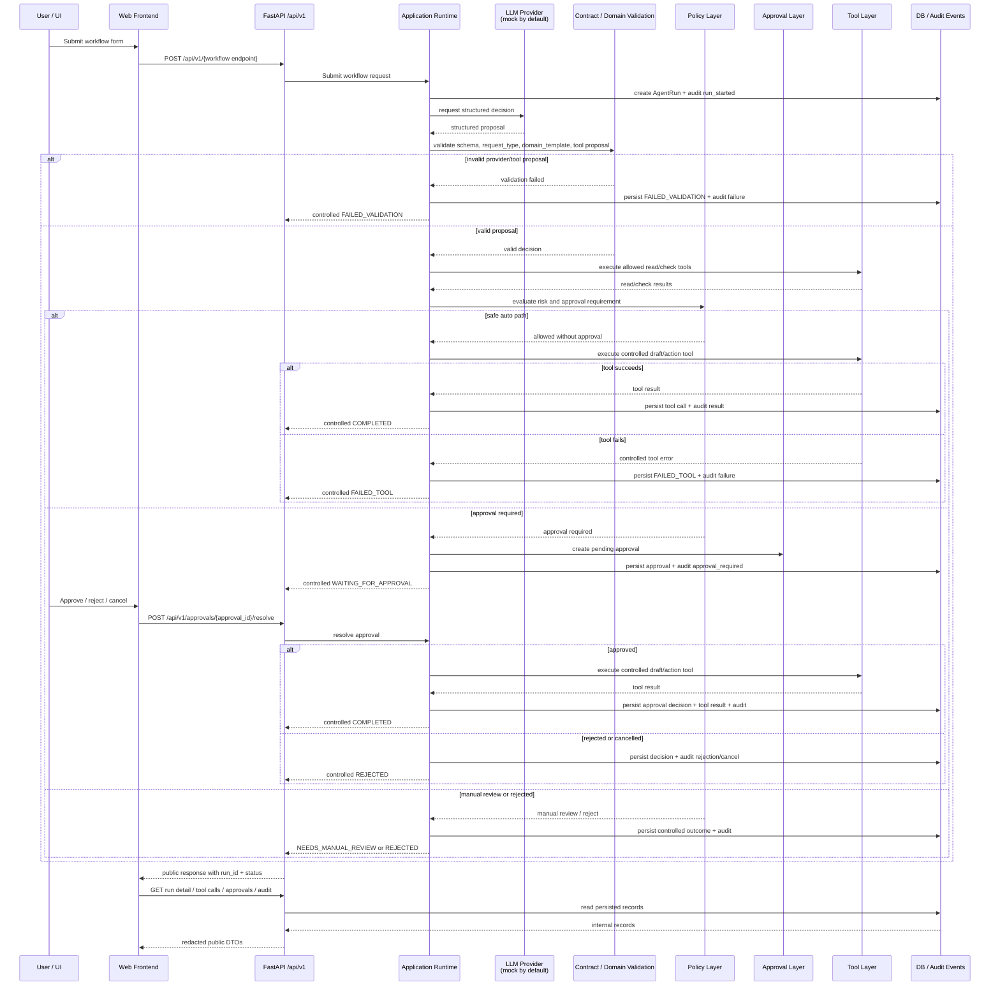

```mermaid
flowchart LR
    Frontend["Frontend<br/>React/Vite client"]
    API["FastAPI /api/v1<br/>HTTP adapter"]
    Runtime["Application runtime<br/>access / procurement / maintenance"]
    Provider["Provider boundary<br/>structured decision"]
    Validation["Backend validation<br/>schema, request_type, domain_template, tools"]
    ReadTools["Tools<br/>registered read checks"]
    Policy["Policy<br/>state-changing action decision"]
    Approval["Approval gate<br/>when policy requires it"]
    ActionTools["Tools<br/>authorized draft action"]
    Audit["Audit<br/>redacted lifecycle events"]
    DB[("SQLite persistence<br/>async SQLAlchemy")]
    Readback["API readback<br/>run-scoped records"]
    Display["Frontend display<br/>local operations console"]

    Frontend --> API --> Runtime --> Provider --> Validation
    Validation --> ReadTools --> Policy
    Policy -->|"allowed"| ActionTools
    Policy -->|"requires approval"| Approval -->|"approved"| ActionTools
    Policy -->|"rejected / manual review"| Audit
    Approval -->|"rejected / cancelled"| Audit
    ActionTools --> Audit
    Runtime --> DB
    Audit --> DB
    DB --> Readback --> Display
```

# Архитектура

## 1. Архитектурный тезис

Enterprise AI Tool Gateway — это шлюз контролируемого выполнения инструментов LLM для локальных demo-workflows. Модель предлагает структурированное решение, но это решение по умолчанию не считается доверенным. Backend валидирует provider output, проверяет request type и domain template, валидирует предложенные tool names, применяет policy, создаёт approval gates при необходимости, выполняет инструменты только через зарегистрированные backend boundaries, записывает audit events и сохраняет records, привязанные к run.

Это не прямое автономное использование инструментов со стороны LLM. LLM не выполняет инструменты, не согласует действия, не пишет в persistence и не владеет workflow state. Эти зоны ответственности принадлежат backend runtime code.

## 2. Высокоуровневый системный поток

API и frontend являются локальными/demo surfaces. Backend API принимает workflow submissions и approval decisions, а readback endpoints раскрывают run details, tool calls, approvals и audit events. Business outcomes представлены run statuses, а не передачей workflow authority на сторону frontend.

## 3. Модель слоёв

Frontend client находится в `frontend/`. Это независимое приложение на React, TypeScript и Vite. Оно обращается к backend через `frontend/src/api` и хранит browser-local known-run index в `frontend/src/state`.

API adapter находится в `src/enterprise_ai_tool_gateway/api/http`. Он отвечает за FastAPI routing, request DTOs, response DTOs, error normalization, dependency wiring и mapping между API DTOs и application DTOs. Routes остаются тонкими: они не выполняют инструменты, не оценивают policy, не создают audit decisions и не владеют workflow state.

Application runtimes находятся в `application/`. Они координируют одну workflow transaction для `ACCESS_REQUEST`, `PROCUREMENT_REQUEST` или `MAINTENANCE_REQUEST`. Они создают runs, вызывают provider boundary, валидируют structured decisions, выполняют registered tools, применяют policy, создают и resolve approvals, сохраняют records и собирают response data.

Contracts находятся в `contracts/`. Они определяют общие enums и Pydantic contracts, такие как `AgentRun`, `LLMDecision`, `ToolCall`, `Approval`, `AuditEvent`, request types, domain templates, tool types, approval modes и run statuses.

Provider boundary находится в `llm/`. Он определяет provider port, safe provider errors, deterministic mock provider behavior, structured-output parsing и optional/manual real-provider support. Provider output должен пройти валидацию по backend contracts, прежде чем runtime примет его.

Policy находится в `policy/`. Он получает backend-built policy request и возвращает decision: allowed, denied, requires approval или needs manual review. Он не выполняет инструменты и не мутирует workflow state.

Tools находятся в `tools/` и workflow-specific packages, таких как `access/`, `procurement/` и `maintenance_lite/`. Generic tool layer владеет `ToolRegistry`, `ToolDefinition` и `ToolExecutor`. Domain packages регистрируют synthetic demo tools и их typed schemas.

Approval находится в `approval/`. Он определяет approval requirements и terminal approval decisions. Application runtimes сохраняют approval records и решают, как approval results влияют на run.

Audit находится в `audit/`. Он создаёт redacted audit event contracts и recursive payload redaction. Persistence этих событий обрабатывается repository layer.

Persistence находится в `db/`. Он использует async SQLAlchemy с локальным SQLite и repository facade для уже валидированных gateway records. Repository сохраняет facts, выбранные runtime layers; он не принимает policy decisions и не определяет workflow outcomes.

Evals находятся в `evals/` и `scripts/run_eval.py`. Они проверяют API через deterministic acceptance cases и mock/fake providers.

## 4. Жизненный цикл запроса

Run создаётся до вызова provider. Затем provider decision сохраняется как запись `LLMDecision`, если его можно представить в виде ожидаемой schema. Runtime validation отклоняет несовпадающие request types, несовпадающие domain templates и неизвестные tool proposals до выполнения любого tool plan. Отсутствующие business fields останавливают процесс со статусом `NEEDS_USER_INPUT`.

Read tools выполняются до финального решения о state-changing draft action. Policy оценивается относительно draft action. Если требуется approval, runtime создаёт pending approval и waiting action tool call, но не выполняет draft tool. Draft tool запускается только после того, как policy разрешила его напрямую, либо после approval pending-согласования.

## 5. Граница выполнения инструментов

`ToolRegistry` — это canonical internal tool boundary. Он хранит именованные объекты `ToolDefinition` с tool name, description, `ToolType`, input model, output model, risk level, default approval metadata и handler.

`ToolExecutor` валидирует каждый input payload по зарегистрированной input Pydantic model, блокирует non-read-only tools, если `execution_authorized=True` не передан, выполняет handler и валидирует output по зарегистрированной output model. Если tool handler выбрасывает исключение, executor возвращает failed tool result с safe error message. Runtime helpers перехватывают registry и validation failures и сохраняют safe failed tool calls.

Текущие значения `ToolType`: `READ_ONLY`, `STATE_CHANGING`, `APPROVAL` и `AUDIT`. Реализованные demo workflows в основном используют read-only synthetic checks и state-changing synthetic draft actions. Категория внешних irreversible enterprise tools не реализована.

Allowed tool names принадлежат каждому runtime и registry. Provider proposals являются только proposals. Unknown tools, tools outside the workflow allowlist или tools, отсутствующие в registry, приводят к validation failure. Backend не угадывает, не fuzzy-match и не autocorrect tool names.

## 6. Approval boundary

Approval требуется, когда policy возвращает `REQUIRES_APPROVAL`. Default policy требует approval для high-risk state-changing tool calls, tools, помеченных как requiring approval by default, и режима `ALWAYS_REQUIRE`. Critical-risk calls переводятся в manual review, а не согласуются автоматически.

Approval safety floor означает, что `AUTO_APPROVE` не может обойти high-risk, critical-risk или default-approval state-changing draft controls. `AUTO_APPROVE` может разрешать low или medium state-changing actions только после того, как backend validation и policy checks приняли действие.

Когда требуется approval, runtime сохраняет pending approval и state-changing action tool call со статусом `WAITING_FOR_APPROVAL`. Draft action не запускается, и draft output не создаётся до обязательного approval.

Approved decision возобновляет run и выполняет waiting action tool call с explicit authorization. Rejected или cancelled decision помечает waiting tool call как rejected при его наличии, обновляет run до `REJECTED` и записывает audit events. Resolve approval, который уже terminal или не принадлежит run, является state conflict на API layer.

## 7. Provider boundary

Providers создают structured decisions, совместимые с `LLMDecisionPayload`. Этот payload включает request type, domain template, confidence, risk level, approval signal, missing fields, proposed tool calls, user-facing summary и reason codes.

Backend валидирует provider result в два этапа. Во-первых, payload должен распарситься и пройти валидацию по Pydantic contract. Во-вторых, selected runtime проверяет semantic constraints: request type должен соответствовать endpoint workflow, domain template должен соответствовать runtime, а proposed tool names должны быть allowed и registered.

API path по умолчанию использует deterministic mock/fake providers. Capabilities endpoint сообщает `provider_mode` как `mock` и раскрывает `model_selection.enabled = false`, `active_profile = "mock"` и `available_profiles = ["mock"]`.

Optional GigaChat support и manual smoke utilities существуют, но real-provider smoke является явным и ручным. Он не является default API или frontend path и не должен запускаться как часть default tests. Не реализованы OpenRouter, YandexGPT runtime selection, provider marketplace, provider fallback routing или frontend model selector.

## 8. Граница audit и redaction

Audit events фиксируют значимые lifecycle steps, такие как run creation, provider selection, decision validation, tool execution, policy checks, approval requests, approval decisions, manual review, rejection, completion и failure.

При создании audit events применяется recursive redaction к payloads до persistence. Public API projection также редактирует/маскирует tool input/output payloads и approval free-text fields, такие как summary, reason, decided_by и decision_comment.

Redaction основан на keys и values. Secret-like keys и значения, содержащие credential markers, заменяются на `[REDACTED]`, а длинные строки обрезаются. Persisted runtime records могут содержать больше внутренних деталей, чем раскрывают public API DTOs, особенно для tool payloads и approval records.

Этот redaction layer является marker-based safety boundary для локального прототипа. Это не полноценный security, privacy, DLP или classification product.

## 9. Модель persistence

Прототип использует локальный SQLite через async SQLAlchemy. Default API app сохраняет данные по локальному SQLite database path и создаёт schema при startup. Tests и evals могут создавать isolated temporary SQLite databases.

Persisted gateway records:

* `AgentRun`: run envelope, request text, approval mode, current status, selected request type/domain template, risk, provider metadata, final summary и safe error fields.
* `LLMDecision`: validated provider decision payload, schema-valid flag, validation errors и confidence.
* `ToolCall`: каждый proposed или executed tool call, tool type, status, input/output payloads, safe error message и approval link.
* `Approval`: pending или terminal approval state, approver role, summary, reason и decision metadata.
* `AuditEvent`: run-scoped event type, actor, redacted payload и timestamp.

Repository является persistence facade. Он сохраняет и читает уже выбранные facts и намеренно не владеет workflow transition validation, policy decisions или tool authorization.

## 10. Граница Frontend/API

Frontend независим от Python backend. `frontend/src/api` отвечает за все HTTP calls к `/api/v1`, включая workflow submit, capabilities, health, approval resolution и run-scoped readback. TypeScript types отражают shapes public API DTO и не импортируют backend Python internals.

Frontend не выполняет workflow logic, не вызывает providers, не оценивает policy, не запускает tools, не approves actions locally и не читает SQLite database. Он отображает backend-controlled results, возвращённые API.

Local known-run index хранит run IDs и selected run ID в browser local storage для текущей demo session. Это не backend global run index, global audit search, production approval queue или multi-user history system.

UI — это локальная Gateway Operations Console для отправки demo workflows, просмотра run detail, разрешения run-scoped approvals и инспекции run-scoped tool calls и audit events.

## 11. Failure model

Controlled business outcomes представлены run statuses. Они не являются автоматическими HTTP errors. Валидный workflow submission может вернуть HTTP 200 с controlled stop status, когда backend намеренно отклоняет, ставит на паузу или безопасно завершает run с ошибкой.

Основные controlled statuses:

* `COMPLETED`: run достиг принятого final state, часто с synthetic draft output.
* `WAITING_FOR_APPROVAL`: существует required approval, а state-changing draft action ещё не выполнен.
* `NEEDS_USER_INPUT`: отсутствуют обязательные request fields.
* `NEEDS_MANUAL_REVIEW`: policy или synthetic data checks требуют manual review.
* `REJECTED`: policy или approval отклонили run.
* `FAILED_VALIDATION`: provider output, domain template или proposed tool names не прошли backend validation.
* `FAILED_TOOL`: tool boundary или draft action безопасно завершились с ошибкой.
* `FAILED_PROVIDER`: provider boundary безопасно завершился с ошибкой.

HTTP errors всё ещё существуют для malformed request bodies, unknown run или approval IDs, invalid approval decisions, state conflicts и unexpected internal API errors. Unexpected API errors возвращают generic safe error response.

## 12. Архитектурные ограничения

Это локальный/demo-прототип. По умолчанию он использует deterministic mock/fake providers и synthetic workflow data для примеров access, procurement и maintenance-lite.

Прототип не реализует production authentication, RBAC, tenants, organization administration, production security hardening, production observability, background workers, hosted deployment или migration management.

Он не включает реальные connectors для IAM, ERP, 1C, Jira, CRM, CMMS, EAM, vendor, purchasing или maintenance. Demo actions создают только synthetic drafts.

Он не реализует provider/model selection, provider routing, OpenRouter или YandexGPT runtime integration, streaming, quota/billing controls или frontend model selector.

Он не реализует workflow builder, policy editor, global backend run/listing search, global audit search или production approval queue. Будущее расширение должно сохранять ту же control model: backend validation, explicit tool boundaries, policy checks, approval gates и auditability.
