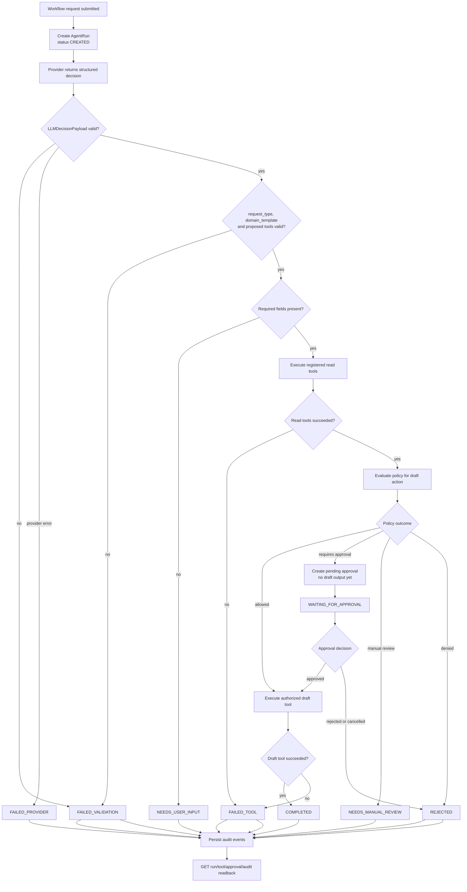

# Architecture

## 1. Architecture thesis

Enterprise AI Tool Gateway is a controlled LLM tool-execution gateway for local
demo workflows. The model proposes a structured decision, but that decision is
not trusted by default. The backend validates the provider output, checks the
request type and domain template, validates proposed tool names, applies policy,
creates approval gates when required, executes tools only through registered
backend boundaries, records audit events and persists run-scoped records.

This is not direct autonomous tool use by the LLM. The LLM does not execute
tools, approve actions, write persistence or own workflow state. Backend runtime
code owns those responsibilities.

## 2. High-level system flow

```mermaid
flowchart LR
    Frontend["Frontend<br/>React/Vite client"]
    API["FastAPI /api/v1<br/>HTTP adapter"]
    Runtime["Application runtime<br/>access / procurement / maintenance"]
    Provider["Provider boundary<br/>structured decision"]
    Validation["Backend validation<br/>schema, request_type, domain_template, tools"]
    ReadTools["Tools<br/>registered read checks"]
    Policy["Policy<br/>state-changing action decision"]
    Approval["Approval gate<br/>when policy requires it"]
    ActionTools["Tools<br/>authorized draft action"]
    Audit["Audit<br/>redacted lifecycle events"]
    DB[("SQLite persistence<br/>async SQLAlchemy")]
    Readback["API readback<br/>run-scoped records"]
    Display["Frontend display<br/>local operations console"]

    Frontend --> API --> Runtime --> Provider --> Validation
    Validation --> ReadTools --> Policy
    Policy -->|"allowed"| ActionTools
    Policy -->|"requires approval"| Approval -->|"approved"| ActionTools
    Policy -->|"rejected / manual review"| Audit
    Approval -->|"rejected / cancelled"| Audit
    ActionTools --> Audit
    Runtime --> DB
    Audit --> DB
    DB --> Readback --> Display
```

The API and frontend are local/demo surfaces. The backend API accepts workflow
submissions and approval decisions, while readback endpoints expose run details,
tool calls, approvals and audit events. Business outcomes are represented by run
statuses, not by giving the frontend workflow authority.

## 3. Layer model

The frontend client lives under `frontend/`. It is an independent React,
TypeScript and Vite application. It calls the backend through `frontend/src/api`
and keeps a browser-local known-run index in `frontend/src/state`.

The API adapter lives under `src/enterprise_ai_tool_gateway/api/http`. It owns
FastAPI routing, request DTOs, response DTOs, error normalization, dependency
wiring and mapping between API DTOs and application DTOs. Routes are thin: they
do not execute tools, evaluate policy, create audit decisions or own workflow
state.

Application runtimes live under `application/`. They coordinate one workflow
transaction for `ACCESS_REQUEST`, `PROCUREMENT_REQUEST` or
`MAINTENANCE_REQUEST`. They create runs, call the provider boundary, validate
structured decisions, execute registered tools, apply policy, create and resolve
approvals, persist records and collect response data.

Contracts live under `contracts/`. They define shared enums and Pydantic
contracts such as `AgentRun`, `LLMDecision`, `ToolCall`, `Approval`,
`AuditEvent`, request types, domain templates, tool types, approval modes and
run statuses.

The provider boundary lives under `llm/`. It defines the provider port, safe
provider errors, deterministic mock provider behavior, structured-output
parsing and optional/manual real-provider support. Provider output must validate
against backend contracts before the runtime accepts it.

Policy lives under `policy/`. It receives a backend-built policy request and
returns a decision: allowed, denied, requires approval or needs manual review.
It does not execute tools or mutate workflow state.

Tools live under `tools/` and workflow-specific packages such as `access/`,
`procurement/` and `maintenance_lite/`. The generic tool layer owns
`ToolRegistry`, `ToolDefinition` and `ToolExecutor`. Domain packages register
synthetic demo tools and their typed schemas.

Approval lives under `approval/`. It defines approval requirements and terminal
approval decisions. Application runtimes persist approval records and decide how
approval results affect a run.

Audit lives under `audit/`. It creates redacted audit event contracts and
recursive payload redaction. Persistence of those events is handled by the
repository layer.

Persistence lives under `db/`. It uses async SQLAlchemy with local SQLite and a
repository facade for already validated gateway records. The repository stores
facts chosen by runtime layers; it does not decide policy or workflow outcomes.

Evals live under `evals/` and `scripts/run_eval.py`. They exercise the API with
deterministic acceptance cases and mock/fake providers.

## 4. Request lifecycle

The run is created before the provider is called. The provider decision is then
persisted as an `LLMDecision` record if it can be represented as the expected
schema. Runtime validation rejects mismatched request types, mismatched domain
templates and unknown tool proposals before any tool plan executes. Missing
business fields stop as `NEEDS_USER_INPUT`.

Read tools run before the final state-changing draft action decision. Policy is
evaluated against the draft action. If approval is required, the runtime creates
a pending approval and a waiting action tool call, but does not execute the
draft tool. The draft tool runs only after policy allows it directly or after a
pending approval is approved.

## 5. Tool execution boundary

`ToolRegistry` is the canonical internal tool boundary. It stores named
`ToolDefinition` objects with a tool name, description, `ToolType`, input model,
output model, risk level, default approval metadata and handler.

`ToolExecutor` validates every input payload against the registered input
Pydantic model, blocks non-read-only tools unless `execution_authorized=True`,
executes the handler and validates the output against the registered output
model. If a tool handler raises, the executor returns a failed tool result with
a safe error message. Runtime helpers catch registry and validation failures and
persist safe failed tool calls.

The current `ToolType` values are `READ_ONLY`, `STATE_CHANGING`, `APPROVAL` and
`AUDIT`. The implemented demo workflows mainly use read-only synthetic checks
and state-changing synthetic draft actions. No external irreversible enterprise
tool category is implemented.

Allowed tool names are owned by each runtime and by the registry. Provider
proposals are only proposals. Unknown tools, tools outside the workflow allowlist
or tools missing from the registry fail validation. The backend does not guess,
fuzzy-match or autocorrect tool names.

## 6. Approval boundary

Approval is required when policy returns `REQUIRES_APPROVAL`. The default policy
requires approval for high-risk state-changing tool calls, tools marked as
requiring approval by default and `ALWAYS_REQUIRE` mode. Critical-risk calls move
to manual review rather than being approved automatically.

The approval safety floor means `AUTO_APPROVE` cannot bypass high-risk,
critical-risk or default-approval state-changing draft controls. `AUTO_APPROVE`
can allow low or medium state-changing actions only after backend validation and
policy checks accept the action.

When approval is required, the runtime persists a pending approval and a
state-changing action tool call with `WAITING_FOR_APPROVAL`. The draft action
does not run and no draft output is produced before required approval.

An approved decision resumes the run and executes the waiting action tool call
with explicit authorization. A rejected or cancelled decision marks the waiting
tool call rejected when present, updates the run to `REJECTED` and records audit
events. Resolving an approval that is already terminal or does not belong to the
run is a state conflict at the API layer.

## 7. Provider boundary

Providers produce structured decisions compatible with `LLMDecisionPayload`.
That payload includes request type, domain template, confidence, risk level,
approval signal, missing fields, proposed tool calls, user-facing summary and
reason codes.

The backend validates the provider result in two stages. First, the payload must
parse and validate against the Pydantic contract. Second, the selected runtime
checks semantic constraints: the request type must match the endpoint workflow,
the domain template must match the runtime and proposed tool names must be
allowed and registered.

The API path uses deterministic mock/fake providers by default. The
capabilities endpoint reports `provider_mode` as `mock` and exposes
`model_selection.enabled = false`, `active_profile = "mock"` and
`available_profiles = ["mock"]`.

Optional GigaChat support and manual smoke utilities exist, but real-provider
smoke is explicit and manual. It is not the default API or frontend path and
must not run as part of default tests. There is no implemented OpenRouter,
YandexGPT runtime selection, provider marketplace, provider fallback routing or
frontend model selector.

## 8. Audit and redaction boundary

Audit events record meaningful lifecycle steps such as run creation, provider
selection, decision validation, tool execution, policy checks, approval requests,
approval decisions, manual review, rejection, completion and failure.

Audit event creation applies recursive redaction to payloads before persistence.
The public API projection also redacts tool input/output payloads and approval
free-text fields such as summary, reason, decided_by and decision_comment.

Redaction is key-based and value-based. Secret-like keys and values containing
credential markers are replaced with `[REDACTED]`, and long strings are
truncated. Persisted runtime records may contain more internal detail than the
public API DTOs expose, especially for tool payloads and approval records.

This redaction layer is a marker-based safety boundary for the local prototype.
It is not a complete security, privacy, DLP or classification product.

## 9. Persistence model

The prototype uses local SQLite through async SQLAlchemy. The default API app
stores data in a local SQLite database path and creates the schema at startup.
Tests and evals can create isolated temporary SQLite databases.

The persisted gateway records are:

* `AgentRun`: the run envelope, request text, approval mode, current status,
  selected request type/domain template, risk, provider metadata, final summary
  and safe error fields.
* `LLMDecision`: the validated provider decision payload, schema-valid flag,
  validation errors and confidence.
* `ToolCall`: each proposed or executed tool call, tool type, status,
  input/output payloads, safe error message and approval link.
* `Approval`: pending or terminal approval state, approver role, summary, reason
  and decision metadata.
* `AuditEvent`: run-scoped event type, actor, redacted payload and timestamp.

The repository is a persistence facade. It stores and reads already chosen facts
and intentionally does not own workflow transition validation, policy decisions
or tool authorization.

## 10. Frontend/API boundary

The frontend is independent from the Python backend. `frontend/src/api` owns all
HTTP calls to `/api/v1`, including workflow submit, capabilities, health,
approval resolution and run-scoped readback. TypeScript types mirror public API
DTO shapes and do not import backend Python internals.

The frontend does not execute workflow logic, call providers, evaluate policy,
run tools, approve actions locally or read the SQLite database. It displays
backend-controlled results returned by the API.

The local known-run index stores run IDs and a selected run ID in browser local
storage for the current demo session. It is not a backend global run index,
global audit search, production approval queue or multi-user history system.

The UI is a local Gateway Operations Console for submitting demo workflows,
viewing run detail, resolving run-scoped approvals and inspecting run-scoped
tool calls and audit events.

## 11. Failure model

Controlled business outcomes are represented as run statuses. They are not
automatically HTTP errors. A valid workflow submission can return HTTP 200 with
a controlled stop status when the backend intentionally rejects, pauses or fails
the run safely.

Primary controlled statuses include:

* `COMPLETED`: the run reached an accepted final state, often with a synthetic
  draft output.
* `WAITING_FOR_APPROVAL`: a required approval exists and the state-changing
  draft action has not executed yet.
* `NEEDS_USER_INPUT`: required request fields are missing.
* `NEEDS_MANUAL_REVIEW`: policy or synthetic data checks require manual review.
* `REJECTED`: policy or approval rejected the run.
* `FAILED_VALIDATION`: provider output, domain template or proposed tool names
  failed backend validation.
* `FAILED_TOOL`: a tool boundary or draft action failed safely.
* `FAILED_PROVIDER`: the provider boundary failed safely.

HTTP errors still exist for malformed request bodies, unknown run or approval
IDs, invalid approval decisions, state conflicts and unexpected internal API
errors. Unexpected API errors return a generic safe error response.

## 12. Architecture limitations

This is a local/demo prototype. It uses deterministic mock/fake providers by
default and synthetic workflow data for access, procurement and maintenance-lite
examples.

The prototype does not implement production authentication, RBAC, tenants,
organization administration, production security hardening, production
observability, background workers, hosted deployment or migration management.

It does not include real IAM, ERP, 1C, Jira, CRM, CMMS, EAM, vendor, purchasing
or maintenance connectors. Demo actions create synthetic drafts only.

It does not implement provider/model selection, provider routing, OpenRouter or
YandexGPT runtime integration, streaming, quota/billing controls or a frontend
model selector.

It does not implement a workflow builder, policy editor, global backend
run/listing search, global audit search or production approval queue. Future
expansion should preserve the same control model: backend validation, explicit
tool boundaries, policy checks, approval gates and auditability.
