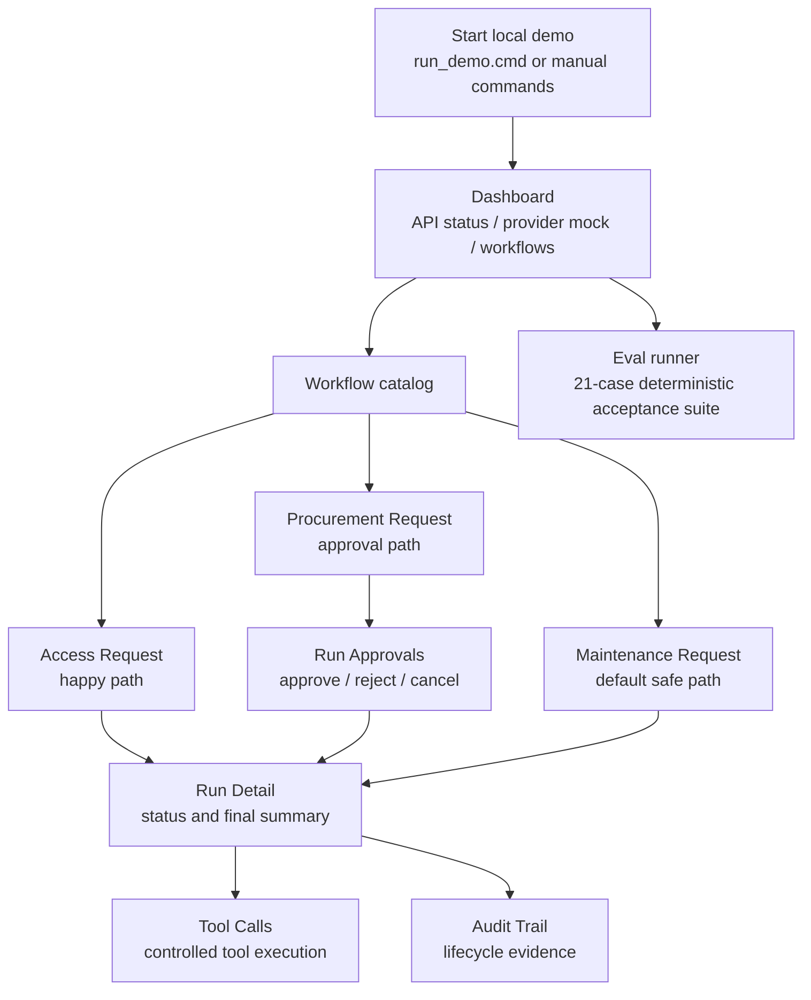

# Демо walkthrough

## 1. Назначение demo

Этот walkthrough показывает, как запустить локальный demo Enterprise AI Tool Gateway и проверить контролируемый жизненный цикл трёх синтетических workflows.

После прохождения walkthrough reviewer должен понимать ключевую control model:

```text
LLM proposes.
Backend validates.
Tools execute through controlled boundaries.
Approval gates risky actions.
Audit records lifecycle evidence.
Frontend displays the controlled lifecycle over /api/v1.
```

Demo является локальным и синтетическим. Оно демонстрирует backend ownership для validation, tool boundaries, policy checks, approvals, audit records и public API readback. Это не production SaaS и не интеграция с реальными enterprise systems.



## 2. Перед началом

Prerequisites:

* локальная checkout-копия этого repository;
* Python и `uv` для backend;
* Node.js и npm для frontend;
* установленные frontend dependencies, если это первый запуск;
* real provider credentials для default demo не требуются.

Default provider mode — `mock`. Real-provider credentials не нужны для API, frontend или eval walkthrough.

Если frontend dependencies отсутствуют, установите их один раз:

```bash
cd frontend
npm install
```

Самый быстрый запуск на Windows:

```text
run_demo.cmd
```

Runner запускает оба локальных сервиса, ожидает готовности и открывает dashboard. Используйте manual commands ниже как fallback path или когда удобнее работать в отдельных терминалах.

## 3. Запуск backend

Из корня repository запустите FastAPI backend:

```bash
uv run uvicorn enterprise_ai_tool_gateway.api.http.app:app --reload
```

Local API версионирован под `/api/v1`.

Проверьте backend health и capability metadata:

```text
GET http://127.0.0.1:8000/api/v1/health
GET http://127.0.0.1:8000/api/v1/capabilities
```

Ожидаемый health response:

```json
{"status": "ok"}
```

Backend root URL может возвращать 404:

```text
GET http://127.0.0.1:8000/
```

Это нормально. Backend не отдаёт frontend root page.

## 4. Запуск frontend

Во втором терминале запустите Vite frontend:

```bash
cd frontend
npm run dev -- --host 127.0.0.1 --port 5173
```

Откройте основной UI:

```text
http://127.0.0.1:5173/dashboard
```

Frontend API client по умолчанию вызывает `/api/v1`. Vite проксирует `/api` на backend по адресу `http://localhost:8000`, поэтому browser requests к `/api/v1/...` попадают в FastAPI endpoints `/api/v1`.

## 5. Первый экран: Dashboard и Settings

На `/dashboard` проверьте основные индикаторы локального demo:

* `API Health` имеет значение `ok`;
* `Provider Mode` имеет значение `mock`;
* `Model Selection` имеет значение `disabled`;
* `Available Workflows` включает три workflow, поддерживаемые backend;
* `Known Runs` и `Pending Approvals` относятся только к run IDs, известным в этой browser session.

Откройте `/settings` и проверьте `Settings / API Status`:

* `API base URL` должен быть `/api/v1`, если он не переопределён через environment;
* `Health` должен быть `ok`;
* `Provider mode` должен быть `mock`;
* `Model selection` должен быть `disabled`;
* capabilities JSON должен показывать `model_selection.enabled: false`,
  `active_profile: "mock"` и `available_profiles: ["mock"]`.

UI — это local operations console поверх backend API. Он не выполняет tools, не оценивает policy, не вызывает providers напрямую и не читает SQLite database.

## 6. Scenario A — Access happy path

Откройте:

```text
http://127.0.0.1:5173/workflows/access
```

Используйте default known-good values:

| Field         | Value                           |
| ------------- | ------------------------------- |
| User ID       | `user-1`                        |
| Request text  | `Need access to CRM.`           |
| Employee ID   | `emp-001`                       |
| System ID     | `crm`                           |
| Access level  | `READ`                          |
| Duration days | `30`                            |
| Approval mode | `HIGH_RISK_ONLY`                |
| Justification | `Need access for routine work.` |

Отправьте форму через `Submit access request`.

Ожидаемый controlled outcome:

* status: `COMPLETED`;
* `Requires approval`: `no`;
* synthetic draft output создаётся backend-controlled tool path.

Откройте run links из submit result:

* `Run Detail`;
* `Tool Calls`;
* `Audit Trail`.

В Run Detail проверьте controlled outcome, final summary, risk и record counts. В Tool Calls проверьте, что access checks и draft action отображаются как backend tool records со statuses и redacted payload JSON. В Audit Trail проверьте lifecycle events, такие как run creation, policy check и completion.

Это доказывает happy path: provider предлагает structured access decision, backend валидирует его, read tools запускаются через registered boundaries, policy разрешает draft action, а audit фиксирует lifecycle.

Если изменить `Access level` на `ADMIN`, тот же workflow должен перейти в controlled approval path вместо прямого завершения.

## 7. Scenario B — Procurement approval path

Откройте:

```text
http://127.0.0.1:5173/workflows/procurement
```

Начните с default form и измените эти поля на reliable approval case:

| Field           | Value                     |
| --------------- | ------------------------- |
| Item ID         | `item-service`            |
| Item name       | `Implementation services` |
| Estimated total | `1500`                    |

Остальные default values оставьте без изменений:

| Field            | Value                    |
| ---------------- | ------------------------ |
| User ID          | `user-1`                 |
| Request text     | `Need to buy equipment.` |
| Requester ID     | `req-001`                |
| Quantity         | `1`                      |
| Currency         | `USD`                    |
| Cost center      | `cc-ops`                 |
| Preferred vendor | `vendor-approved-001`    |
| Approval mode    | `HIGH_RISK_ONLY`         |
| Justification    | `Need equipment.`        |

Отправьте форму через `Submit procurement request`.

Ожидаемый initial controlled outcome:

* status: `WAITING_FOR_APPROVAL`;
* `Requires approval`: `yes`;
* возвращается pending approval;
* purchase request draft action ещё не выполнен.

Откройте:

```text
/runs/{run_id}/approvals
```

Выберите pending approval. В форме поле `Decided by` по умолчанию заполнено как `manager-001`. Выберите одну ветку:

* нажмите `Approve`, чтобы resolve approval и завершить run;
* нажмите `Reject`, чтобы отклонить run без draft;
* нажмите `Cancel`, чтобы отменить approval и отклонить run без draft.

После approval обновите или откройте Run Detail и ожидайте final status `COMPLETED`. После reject или cancel ожидайте final status `REJECTED`.

Проверьте Tool Calls:

* до approval draft action не должен успешно выполниться;
* после approval draft action может успешно выполниться и создать synthetic draft;
* после rejection или cancellation draft не создаётся.

Проверьте Audit Trail на наличие approval request, approval decision и final lifecycle events. Это доказывает, что high-value procurement не создаёт draft до approval, а approval resolution обрабатывается backend API, а не local UI logic.

## 8. Scenario C — Maintenance default/safe path

Откройте:

```text
http://127.0.0.1:5173/workflows/maintenance
```

Используйте default known-good values:

| Field             | Value                                    |
| ----------------- | ---------------------------------------- |
| User ID           | `user-1`                                 |
| Request text      | `Routine inspection for Cooling pump 1.` |
| Requester ID      | `maint-req-001`                          |
| Asset ID          | `asset-pump-001`                         |
| Asset name        | `Cooling pump 1`                         |
| Location          | `Plant A`                                |
| Observed severity | `LOW`                                    |
| Approval mode     | `HIGH_RISK_ONLY`                         |
| Issue description | `Routine inspection needed.`             |
| Safety concern    | unchecked                                |

Отправьте форму через `Submit maintenance request`.

Ожидаемый controlled outcome:

* status: `COMPLETED`;
* pending approval отсутствует;
* создаётся synthetic maintenance work order draft;
* audit/tool records показывают low-severity maintenance path.

Используйте uppercase maintenance severity values из UI selector:

```text
LOW
MEDIUM
HIGH
CRITICAL
```

Backend валидирует canonical `MaintenanceSeverity` values. Lowercase или unknown API payload values не являются documented default UI path.

Не скрывайте `FAILED_TOOL` во время экспериментов. Если `FAILED_TOOL` появляется при другом arbitrary maintenance input, это controlled backend failure state, безопасно отображаемый UI. Это не UI crash, и его не следует представлять как successful maintenance outcome.

## 9. Инспекция run

Run-scoped frontend pages:

| Page                        | Purpose                                                                                                                   |
| --------------------------- | ------------------------------------------------------------------------------------------------------------------------- |
| `/runs/{run_id}`            | Run Detail: controlled outcome, final summary, run metadata, record counts и run JSON.                                    |
| `/runs/{run_id}/approvals`  | Run Approvals: pending или terminal approvals для этого run, а также approval actions, если approval находится в pending. |
| `/runs/{run_id}/tool-calls` | Run Tool Calls: tool names, tool types, statuses, approval links, safe errors и redacted input/output payloads.           |
| `/runs/{run_id}/audit`      | Run Audit Trail: chronological audit events, actors и selected event payload JSON.                                        |

Страница Agent Runs — это session-known index, построенный из browser-local run IDs. У backend сейчас нет global run listing endpoint. Local known-run index — это demo convenience, а не backend truth.

Чтобы проверить существующий run, вставьте его `run_id` в control `Open Run` на Dashboard или Settings. Если backend знает этот run, UI добавит его в local known-run index и откроет страницу run detail.

## 10. Запуск evals

Запустите deterministic API acceptance suite:

```bash
uv run python scripts/run_eval.py
uv run python scripts/run_eval.py --format json
```

Ожидаемый результат:

```text
21/21 passed
```

Text report выводит:

```text
Total: 21  Passed: 21  Failed: 0
```

Evals доказывают deterministic backend/API behavior для controlled statuses, approval gating, no-draft-before-approval behavior, readback endpoints, audit events, reason codes, redaction-related expectations и failed-validation handling.

Evals не доказывают production security, real provider quality, real enterprise connector behavior, auth/RBAC/tenant behavior, scalability, full UI E2E coverage или production monitoring readiness.

## 11. На что обратить внимание во время demo

* Backend-controlled lifecycle от workflow submit до final run status.
* Approval boundary для risky state-changing draft actions.
* Draft/no-draft behavior до и после approval decisions.
* Tool-call visibility с registered tool names, statuses и safe errors.
* Audit trail с run-scoped lifecycle evidence.
* Redacted public payload projection в API и UI readback.
* Controlled failure statuses, такие как `NEEDS_USER_INPUT`, `NEEDS_MANUAL_REVIEW`,
  `REJECTED`, `FAILED_VALIDATION`, `FAILED_TOOL` и `FAILED_PROVIDER`.
* Разделение Frontend/API: React client отображает backend-controlled results через `/api/v1`.

## 12. Troubleshooting

Backend root `/` возвращает 404:

Это нормально. Используйте `/api/v1/health`, `/api/v1/capabilities` или frontend dashboard.

Frontend не может подключиться к API:

Убедитесь, что backend запущен на порту 8000, а frontend запущен через Vite dev server. Frontend вызывает `/api/v1`, а Vite проксирует `/api` на `http://localhost:8000`.

`npm` отсутствует в PATH на Windows:

При необходимости используйте полный путь к npm:

```text
C:\Program Files\nodejs\npm.cmd
```

Black screen:

Проверьте browser console и Vite terminal. Текущий frozen prototype не должен показывать blank screen в documented default paths.

Maintenance возвращает `FAILED_TOOL` для non-default arbitrary input:

Считайте это controlled backend failure state. Используйте documented known-good maintenance values для default/safe walkthrough и проверяйте Tool Calls и Audit Trail вместо того, чтобы считать это UI crash.

Real provider credentials:

Они не требуются для default demo. Default provider mode — `mock`.

## 13. Demo limitations

Это demo намеренно ограничено:

* только local/demo;
* synthetic workflow data;
* deterministic mock provider по умолчанию;
* нет auth, RBAC или tenants;
* нет реальных IAM, ERP, 1C, Jira, CRM, CMMS, EAM или других enterprise connectors;
* нет provider/model selection;
* нет production deployment;
* нет global backend run listing или global audit search;
* нет claim о full UI E2E test coverage.

Демонстрируемая ценность — это control pattern: backend validation, controlled tool boundaries, policy checks, approval gates, audit records и public run-scoped readback.
