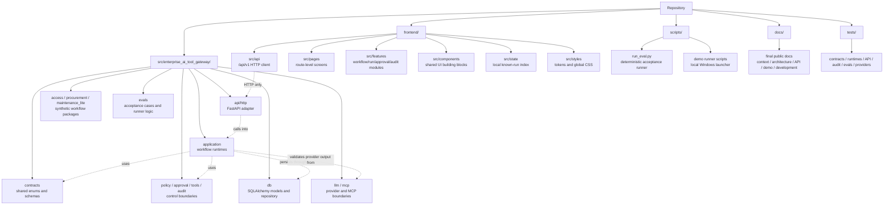

# Project Map

## 1. Repository overview

`enterprise-ai-tool-gateway` contains a local/demo Enterprise AI Tool Gateway
prototype. The repository is organized around a Python backend gateway, a
FastAPI `/api/v1` adapter, deterministic API acceptance evals, an independent
React/Vite frontend and final project documentation.

The backend demonstrates controlled LLM-proposed tool use: provider output is
validated by backend contracts, tools execute only through registered
boundaries, state-changing draft actions pass through policy and approval
controls, and run-scoped records are persisted for readback.

Top-level areas:

| Path | Ownership |
| --- | --- |
| `src/enterprise_ai_tool_gateway/` | Python backend package for contracts, runtimes, tools, policy, approval, audit, persistence, providers, API and eval support. |
| `frontend/` | Independent React, TypeScript and Vite local web client. |
| `tests/` | Offline deterministic Python test suite for backend, API, eval and boundary behavior. |
| `scripts/` | Manual command entrypoints, including the deterministic eval runner and explicit smoke utilities. |
| `docs/` | Public project documentation and source-of-truth companion docs. |
| `pyproject.toml` | Python package metadata, Python `>=3.14`, runtime dependencies and tool configuration. |



## 2. Backend package map

Main backend packages under `src/enterprise_ai_tool_gateway/`:

| Package | Ownership |
| --- | --- |
| `contracts/` | Shared enums and Pydantic contracts for request types, domain templates, run records, LLM decisions, tools, approvals and audit events. |
| `workflow/` | Pure workflow event/status transition helpers for `AgentRunStatus`. |
| `llm/` | Provider port, deterministic providers, structured-output parsing, safe provider errors, optional GigaChat support and deferred YandexGPT spike stubs. |
| `mcp/` | Optional local MCP-style boundary and smoke-support utilities; it does not replace `ToolRegistry`. |
| `tools/` | Generic `ToolDefinition`, `ToolRegistry` and `ToolExecutor` boundary with Pydantic input/output validation. |
| `policy/` | Policy request/decision contracts and default tool-policy evaluator. |
| `approval/` | Approval requirement and approval decision primitives. |
| `audit/` | Audit event creation and recursive payload redaction helpers. |
| `db/` | Async SQLAlchemy models, schema bootstrap, session factory and repository facade for local SQLite persistence. |
| `demo_domain/` | Deterministic synthetic access, procurement and maintenance data used by demo tools. |
| `access/` | Access workflow demo schemas and synthetic access tool definitions. |
| `procurement/` | Procurement workflow demo schemas and synthetic procurement tool definitions. |
| `maintenance_lite/` | Maintenance-lite demo schemas and synthetic maintenance tool definitions. |
| `application/` | Workflow runtimes, shared runtime helpers and application DTOs. |
| `api/http/` | FastAPI inbound adapter, routes, API schemas, mappers, dependencies and error normalization. |
| `evals/` | Deterministic API acceptance case definitions, dependency overrides, runner and result models. |

## 3. Contracts

`src/enterprise_ai_tool_gateway/contracts/` defines shared backend shapes.

| File | Ownership |
| --- | --- |
| `enums.py` | Stable string enums for request types, domain templates, run statuses, risk levels, tool types, tool-call statuses, approval statuses, policy decisions, approval modes, audit events and provider names. |
| `schemas.py` | Pydantic contracts for agent runs, proposed tool calls, LLM decisions, tool calls, approvals and audit events. |
| `__init__.py` | Public contract exports. |

Important contract groups:

| Contract area | Examples |
| --- | --- |
| Request and domain classification | `RequestType`, `DomainTemplate`, `LLMDecisionPayload`. |
| Run lifecycle | `AgentRunCreate`, `AgentRunRead`, `AgentRunStatus`. |
| Tool boundary | `ProposedToolCall`, `ToolCallCreate`, `ToolCallRead`, `ToolType`, `ToolCallStatus`. |
| Approval and policy | `ApprovalCreate`, `ApprovalRead`, `ApprovalMode`, `ApprovalStatus`, `PolicyDecisionStatus`. |
| Audit | `AuditEventCreate`, `AuditEventRead`, `AuditEventType`. |

Boundary rule: contracts define shared data shapes and enum vocabularies. They
must not own runtime orchestration, policy decisions, provider calls, database
queries, FastAPI routing or frontend behavior.

## 4. Application runtimes

`src/enterprise_ai_tool_gateway/application/` owns backend orchestration for the
implemented demo workflows.

| File | Ownership |
| --- | --- |
| `access_runtime.py` | `ACCESS_REQUEST` runtime: creates runs, calls the provider, validates access decisions, executes access tools, applies policy, creates/resolves approvals and persists records. |
| `procurement_runtime.py` | `PROCUREMENT_REQUEST` runtime: coordinates synthetic requester/vendor/catalog/budget/duplicate checks and draft purchase request creation. |
| `maintenance_lite_runtime.py` | `MAINTENANCE_REQUEST` runtime: coordinates synthetic requester/asset/severity/duplicate/policy checks and draft work order creation. |
| `demo_workflow.py` | Shared runtime mechanics such as missing-field checks, proposed-tool validation, tool execution/persistence, audit persistence, policy request construction, approval handling and runtime record collection. |
| `dtos.py` | Application-layer request/result DTOs for workflow submit and approval resolution use cases. |

The application runtimes own workflow decisions and use-case orchestration.
They decide which contracts, tools, policy checks, approvals, audit events and
repository operations are used for a single run.

Boundary rules:

* API routes call application runtimes; routes do not own workflow logic.
* Application runtimes validate provider decisions before any proposed tool plan
  is accepted.
* Application runtimes must execute tools through the registry/executor
  boundary.
* Application runtimes may persist records through `GatewayRepository`, but the
  repository does not decide workflow outcomes.

## 5. Domain workflow packages

The workflow-specific packages own synthetic demo schemas and tools only.

| Package | Ownership |
| --- | --- |
| `access/` | Access-level schemas, employee/system/access-policy/ticket checks and `create_access_request_draft`. |
| `procurement/` | Procurement schemas, requester/vendor/catalog/budget/duplicate checks, procurement policy check and `create_purchase_request_draft`. |
| `maintenance_lite/` | Maintenance schemas, requester/asset/severity/duplicate checks, maintenance policy check and `create_work_order_draft`. |

These packages register `ToolDefinition` objects into a `ToolRegistry`. Their
state-changing tools create synthetic drafts only. They do not implement real
IAM, ERP, procurement, purchasing, CMMS, EAM or maintenance connectors.

`src/enterprise_ai_tool_gateway/demo_domain/` holds deterministic in-memory
demo data used by these tools. It represents future external sources without
implementing real enterprise integrations.

Boundary rules:

* Domain packages must not own API routing, provider selection, approval
  resolution, persistence policy, workflow state transitions or HTTP concerns.
* Domain tools must remain registered backend tools, not direct frontend or LLM
  actions.
* No domain-specific database tables are implemented for these synthetic
  workflows.

## 6. API layer

`src/enterprise_ai_tool_gateway/api/http/` is the FastAPI adapter over `/api/v1`.

| Area | Ownership |
| --- | --- |
| `app.py` | App factory, lifespan setup, SQLite schema bootstrap and `/api/v1` router assembly. |
| `routes/` | HTTP endpoints for health, capabilities, workflow submit, approval resolution and run-scoped readback. |
| `schemas/` | API request/response DTOs for public HTTP payloads. |
| `mappers.py` | Mapping between API DTOs, application DTOs and redacted public response DTOs. |
| `dependencies.py` | Request-scoped DB session, repository and runtime dependency wiring. |
| `errors.py` | HTTP error helpers and generic exception handling. |

Implemented local API endpoints:

| Method and path | Purpose |
| --- | --- |
| `GET /api/v1/health` | Local health response. |
| `GET /api/v1/capabilities` | Supported request types, approval modes and disabled model-selection metadata. |
| `POST /api/v1/access-requests` | Submit an access workflow request. |
| `POST /api/v1/procurement-requests` | Submit a procurement workflow request. |
| `POST /api/v1/maintenance-requests` | Submit a maintenance-lite workflow request. |
| `POST /api/v1/approvals/{approval_id}/resolve` | Resolve a pending run-scoped approval. |
| `GET /api/v1/runs/{run_id}` | Read run detail with related records. |
| `GET /api/v1/runs/{run_id}/tool-calls` | Read run-scoped tool calls. |
| `GET /api/v1/runs/{run_id}/approvals` | Read run-scoped approvals. |
| `GET /api/v1/runs/{run_id}/audit-events` | Read run-scoped audit events. |

Boundary rules:

* API is an inbound adapter, not the owner of business logic.
* API routes map requests/responses and wire dependencies.
* API routes must not execute tools directly, evaluate policy directly, create
  approval decisions independently or mutate workflow state outside application
  runtime calls.
* Public API responses must go through safe mappers/projections.

## 7. Policy / approval / tools / audit

The control foundation is split across dedicated packages.

| Package | Ownership |
| --- | --- |
| `policy/` | `PolicyCheckRequest`, `PolicyDecision` and `evaluate_default_tool_policy`. The default policy returns allowed, requires-approval or manual-review decisions based on tool type, risk, approval mode and tool metadata. |
| `approval/` | `ApprovalRequirement`, `ApprovalDecision`, terminal/granted helpers and approval primitive validation. |
| `tools/` | `ToolRegistry`, `ToolDefinition`, `ToolExecutor`, duplicate/unknown tool errors, Pydantic input/output validation and state-changing execution authorization. |
| `audit/` | `create_audit_event`, recursive payload redaction, sensitive-key/value detection and string truncation. |

Current safety facts:

* `ToolRegistry` is the canonical internal tool boundary.
* `ToolExecutor` blocks non-read-only tools unless execution is explicitly
  authorized.
* Unknown tools fail validation; runtimes do not guess or autocorrect tool
  names.
* The default policy includes an `AUTO_APPROVE` safety floor: critical risk
  moves to manual review, high-risk state-changing calls still require
  approval, and tools marked as approval-required by default still require
  approval.
* Public projection is strengthened by mapping tool input/output payloads and
  approval free-text fields through redaction helpers before API response.
* Audit event creation redacts payloads before persistence.

Boundary rules:

* `policy/` decides policy outcomes only; it does not execute tools, write
  persistence or mutate workflow state.
* `approval/` defines approval primitives only; application runtimes decide how
  approvals affect runs.
* `tools/` owns execution boundary mechanics only; it does not own LLM reasoning,
  HTTP routing or workflow orchestration.
* `audit/` creates redacted audit contracts; it does not own long-term storage
  or external log shipping.

## 8. Persistence

`src/enterprise_ai_tool_gateway/db/` owns local SQLite persistence through async
SQLAlchemy.

| File | Ownership |
| --- | --- |
| `models.py` | SQLAlchemy models for agent runs, LLM decisions, tool calls, approvals and audit events. |
| `repository.py` | `GatewayRepository`, read/write methods and model-to-contract mapping. |
| `session.py` | Async engine/session factory helpers and SQLite foreign-key configuration. |
| `bootstrap.py` | Schema creation helper used by the local API app and tests. |
| `base.py` | Declarative base. |

Persisted record types:

* agent runs;
* validated LLM decisions;
* tool calls;
* approvals;
* audit events.

Boundary rule: `db/` stores facts chosen by runtime layers. It does not decide
policy, authorize tools, validate provider semantics, enforce workflow
transitions or choose public API projection rules.

## 9. Provider/MCP boundaries

Provider code lives under `src/enterprise_ai_tool_gateway/llm/`.

| File | Ownership |
| --- | --- |
| `base.py` | Provider port, decision request/response contracts, safe provider error hierarchy and real-smoke guard helpers. |
| `mock.py` | Deterministic mock provider used by default tests and local/demo paths. |
| `static.py` | Static decision provider helpers for deterministic procurement and maintenance demo behavior. |
| `structured_output.py` | JSON extraction and `LLMDecisionPayload` parsing from raw provider text. |
| `factory.py` | Environment-based provider construction for supported explicit modes. |
| `gigachat.py` | Optional/manual GigaChat configuration, transport, prompt/payload building and response parsing. |
| `yandex.py` | Deferred YandexGPT settings/spike stub; no active runtime integration. |

Provider boundary rules:

* Providers propose structured decisions only.
* Provider output is untrusted until parsed and validated against backend
  contracts.
* Runtime validation must still check request type, domain template and allowed
  tool names after schema validation.
* Default tests and local API behavior use deterministic mock/static providers.
* GigaChat is optional/manual and must be explicitly configured; failed real
  provider setup must not silently fall back to mock.
* OpenRouter and active YandexGPT runtime selection are not implemented.
* The API capabilities endpoint exposes model selection as disabled with the
  active mock profile.

MCP code lives under `src/enterprise_ai_tool_gateway/mcp/`.

| File | Ownership |
| --- | --- |
| `boundary.py` | MCP-style client boundary, safe errors, typed demo system-status tool and result extraction/validation helpers. |
| `server.py` | Local demo MCP server helpers for manual smoke usage. |

MCP is an optional external tool boundary. It does not replace `ToolRegistry`
as the internal safety model.

## 10. Evals and scripts

Deterministic eval support lives under `src/enterprise_ai_tool_gateway/evals/`
and `scripts/run_eval.py`.

| Area | Ownership |
| --- | --- |
| `evals/cases.py` | 21-case acceptance suite covering access, procurement and maintenance workflow outcomes. |
| `evals/runner.py` | In-process FastAPI API runner, approval resolution flow, readback assertions and text result formatting. |
| `evals/providers.py` | Dependency override helpers for deterministic provider behavior in eval runs. |
| `evals/results.py` | Eval result models and serialization. |
| `scripts/run_eval.py` | CLI wrapper for the deterministic acceptance suite with text and JSON output. |

The eval runner exercises the API surface with deterministic providers and local
SQLite test databases. It is an acceptance suite for gateway behavior, not an
LLM benchmark, provider comparison harness or external-service test.

Manual utility scripts:

| Script | Purpose |
| --- | --- |
| `scripts/mcp_smoke.py` | Manual local MCP boundary smoke utility. |
| `scripts/manual_gigachat_smoke.py` | Explicit/manual GigaChat smoke utility; it must not be part of default tests. |

## 11. Frontend package map

`frontend/` is an independent React, TypeScript and Vite client. It is not part
of the Python package and does not import backend internals.

| Path | Ownership |
| --- | --- |
| `frontend/package.json` | Frontend package metadata and scripts: `dev`, `typecheck`, `build`, `preview`. |
| `frontend/vite.config.ts` | Vite React configuration and local `/api` proxy to `http://localhost:8000`. |
| `frontend/src/api/` | All HTTP calls to the backend `/api/v1` surface, frontend API types and API error handling. |
| `frontend/src/app/` | App shell and React Router route definitions. |
| `frontend/src/pages/` | Page-level screens for dashboard, workflow catalog, workflow submit pages, run detail, run-scoped approvals/tool calls/audit, session approvals and settings. |
| `frontend/src/features/` | Feature modules for workflows, approvals, runs, tool calls, audit and capabilities/API status. |
| `frontend/src/components/` | Reusable layout, feedback, data, form and status components. |
| `frontend/src/state/` | Browser-local known-run index and selected-run state. |
| `frontend/src/styles/` | CSS tokens and global styles. |
| `frontend/src/types/` | Shared frontend-local TypeScript types when present. |

Frontend boundary rules:

* `frontend/src/api/` owns backend communication.
* Frontend types mirror public API payloads; they do not import Python
  contracts.
* The local known-run index stores browser-local run IDs for the demo session.
  It is not backend global search or a production queue.
* The frontend displays backend-controlled outcomes; it does not call providers,
  execute tools, evaluate policy, approve actions locally or read the SQLite
  database.

## 12. Tests map

`tests/` contains deterministic Python tests. Default tests must stay offline
and must not call real providers or external enterprise systems.

| Test area | Representative files |
| --- | --- |
| Contracts | `test_contracts.py`. |
| Workflow transitions | `test_workflow.py`. |
| Tools and registry/executor | `test_tools.py`, `test_access_tools.py`, `test_procurement_tools.py`, `test_maintenance_tools.py`. |
| Policy and approval primitives | `test_policy.py`, `test_approval.py`. |
| Application runtimes | `test_access_runtime.py`, `test_procurement_runtime.py`, `test_maintenance_runtime.py`, `test_demo_workflow_helpers.py`. |
| API routes and public mappers | `test_api_health_capabilities.py`, `test_api_workflows.py`, `test_api_approvals_runs.py`, `test_api_mappers.py`. |
| Audit and redaction | `test_audit.py`, plus API mapper/readback tests for public projection. |
| Persistence | `test_db.py`. |
| Evals | `test_evals.py`. |
| Provider and structured output | `test_llm_spike.py`, `test_structured_output.py`, `test_gigachat_provider.py`. |
| MCP boundary | `test_mcp_boundary.py`, `test_mcp_spike.py`. |
| Import boundaries | `test_import_boundaries.py`. |

Frontend validation is not part of the Python test suite. The frontend package
is validated with npm commands such as:

```bash
cd frontend
npm run typecheck
npm run build
```

## 13. Documentation map

Source-of-truth documentation in `docs/` and the repository root:

| Document | Status | Ownership |
| --- | --- | --- |
| `README.md` | written | Public quickstart, local API/frontend commands and validation commands. |
| `docs/PROJECT_CONTEXT.md` | written | Current prototype scope, implemented workflows, safety status and intentional non-goals. |
| `docs/ARCHITECTURE.md` | written | System architecture, lifecycle, boundaries, failure model and limitations. |
| `docs/PROJECT_MAP.md` | this document | Concrete repository structure, package ownership, entrypoints and boundary rules. |
| `docs/API_AND_EVALS.md` | written | Public API surface, controlled outcomes, redaction behavior and deterministic eval suite. |
| `docs/DEMO_WALKTHROUGH.md` | written | Local demo flow walkthroughs for backend, frontend and eval runner. |
| `docs/DEVELOPMENT_GUIDE.md` | written | Setup, validation, smoke checks and safe development workflow. |

Additional existing support docs:

| Document | Ownership |
| --- | --- |
| `docs/LLM_PROVIDER_POLICY.md` | Provider/model/tool-calling policy and real-provider guardrails. |
| `docs/DEVELOPMENT_CHECKLIST.md` | Current development and validation checklist. |

Documentation boundary rules:

* Public docs should describe the implemented local/demo prototype accurately.
* Preserved local task, report, plan and diff artifacts under ignored working
  directories are not public source-of-truth docs.
* Documentation must not claim production readiness, real enterprise
  integrations, auth/RBAC/tenants, provider/model selection, deployment
  readiness, workflow builder or policy editor support unless those features are
  actually implemented and approved.

## 14. Import and boundary rules

Core boundary rules:

* Frontend code must not import backend Python internals.
* API routes must remain thin inbound adapters over `/api/v1`.
* Application runtimes own orchestration and workflow decisions.
* Contracts must not depend on application runtimes, API routes, provider
  implementations or persistence.
* The database/repository layer must not own workflow decisions, policy
  decisions or tool authorization.
* Tools execute only through `ToolRegistry` / `ToolExecutor` or an explicitly
  bounded MCP/MCP-like boundary.
* Provider output must be parsed and validated before runtime use.
* Runtime validation must reject mismatched request types, mismatched domain
  templates and unknown or disallowed tool proposals.
* State-changing tools require policy checks.
* Risky or default-approval state-changing tools require approval before draft
  execution.
* Public API responses must use safe projection/redaction for tool payloads and
  approval free-text fields.
* MCP is optional and must not replace `ToolRegistry` as the canonical internal
  tool boundary.
* Real provider smoke must remain explicit/manual/configured and outside
  default pytest.

Practical dependency direction:

```text
contracts
  -> workflow / tools / policy / approval / audit / db
  -> domain workflow packages
  -> application runtimes
  -> api/http
  -> frontend over HTTP only
```

The arrows describe allowed consumption direction. They do not mean lower layers
may call upward into API, frontend or application runtime code.

## 15. Ignored / temporary / generated artifacts

Ignored and local-only artifacts include:

| Artifact | Handling |
| --- | --- |
| `frontend/node_modules/` | Ignored dependency install output. |
| `frontend/dist/` | Ignored Vite build output. |
| `frontend/.vite/` | Ignored Vite cache. |
| `.venv/`, `.pytest_cache/`, `.ruff_cache/`, `.pyright/`, `__pycache__/` | Ignored local Python/tool caches. |
| `/data/`, `*.db`, `*.sqlite`, `*.sqlite3`, `*.log` | Ignored local runtime data and logs. |
| `.env`, `.env.*` except `.env.example` | Ignored local environment and secret files. |
| `*.diff`, `*.patch` | Ignored local review/diff artifacts. |
| local task/report/plan artifacts under ignored working directories | Temporary working artifacts when present locally; they should not be treated as public source-of-truth docs. |

Do not commit secrets, credentials, local database files, generated dependency
folders, build outputs or temporary task/report/diff artifacts.
