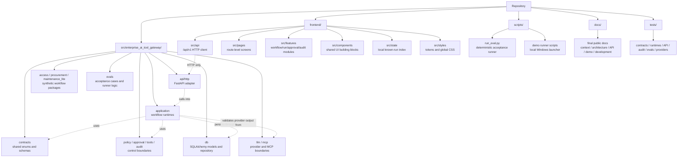

# Карта проекта

## 1. Обзор репозитория

`enterprise-ai-tool-gateway` содержит локальный/demo-прототип Enterprise AI Tool Gateway. Репозиторий организован вокруг Python backend gateway, FastAPI adapter `/api/v1`, детерминированных API acceptance evals, независимого React/Vite frontend и финальной проектной документации.

Backend демонстрирует контролируемое использование инструментов, предложенных LLM: provider output валидируется backend contracts, инструменты выполняются только через зарегистрированные boundaries, state-changing draft actions проходят через policy и approval controls, а records, привязанные к run, сохраняются для последующего readback.

Верхнеуровневые области:

| Путь                              | Зона ответственности                                                                                                        |
| --------------------------------- | --------------------------------------------------------------------------------------------------------------------------- |
| `src/enterprise_ai_tool_gateway/` | Python backend package для contracts, runtimes, tools, policy, approval, audit, persistence, providers, API и eval support. |
| `frontend/`                       | Независимый локальный web client на React, TypeScript и Vite.                                                               |
| `tests/`                          | Offline deterministic Python test suite для backend, API, eval и boundary behavior.                                         |
| `scripts/`                        | Ручные command entrypoints, включая deterministic eval runner и explicit smoke utilities.                                   |
| `docs/`                           | Публичная проектная документация и source-of-truth companion docs.                                                          |
| `pyproject.toml`                  | Метаданные Python package, Python `>=3.14`, runtime dependencies и tool configuration.                                      |



## 2. Карта backend package

Основные backend packages в `src/enterprise_ai_tool_gateway/`:

| Package             | Зона ответственности                                                                                                                                 |
| ------------------- | ---------------------------------------------------------------------------------------------------------------------------------------------------- |
| `contracts/`        | Общие enums и Pydantic contracts для request types, domain templates, run records, LLM decisions, tools, approvals и audit events.                   |
| `workflow/`         | Чистые helpers для workflow event/status transitions для `AgentRunStatus`.                                                                           |
| `llm/`              | Provider port, deterministic providers, structured-output parsing, safe provider errors, optional GigaChat support и deferred YandexGPT spike stubs. |
| `mcp/`              | Опциональная локальная MCP-style boundary и smoke-support utilities; не заменяет `ToolRegistry`.                                                     |
| `tools/`            | Generic boundary `ToolDefinition`, `ToolRegistry` и `ToolExecutor` с Pydantic input/output validation.                                               |
| `policy/`           | Policy request/decision contracts и default tool-policy evaluator.                                                                                   |
| `approval/`         | Approval requirement и approval decision primitives.                                                                                                 |
| `audit/`            | Audit event creation и recursive payload redaction helpers.                                                                                          |
| `db/`               | Async SQLAlchemy models, schema bootstrap, session factory и repository facade для локального SQLite persistence.                                    |
| `demo_domain/`      | Детерминированные synthetic access, procurement и maintenance data, используемые demo tools.                                                         |
| `access/`           | Demo schemas для access workflow и synthetic access tool definitions.                                                                                |
| `procurement/`      | Demo schemas для procurement workflow и synthetic procurement tool definitions.                                                                      |
| `maintenance_lite/` | Demo schemas для maintenance-lite и synthetic maintenance tool definitions.                                                                          |
| `application/`      | Workflow runtimes, shared runtime helpers и application DTOs.                                                                                        |
| `api/http/`         | FastAPI inbound adapter, routes, API schemas, mappers, dependencies и error normalization.                                                           |
| `evals/`            | Deterministic API acceptance case definitions, dependency overrides, runner и result models.                                                         |

## 3. Contracts

`src/enterprise_ai_tool_gateway/contracts/` определяет общие backend shapes.

| File          | Зона ответственности                                                                                                                                                                                    |
| ------------- | ------------------------------------------------------------------------------------------------------------------------------------------------------------------------------------------------------- |
| `enums.py`    | Stable string enums для request types, domain templates, run statuses, risk levels, tool types, tool-call statuses, approval statuses, policy decisions, approval modes, audit events и provider names. |
| `schemas.py`  | Pydantic contracts для agent runs, proposed tool calls, LLM decisions, tool calls, approvals и audit events.                                                                                            |
| `__init__.py` | Public contract exports.                                                                                                                                                                                |

Важные группы contracts:

| Область contract                  | Примеры                                                                                     |
| --------------------------------- | ------------------------------------------------------------------------------------------- |
| Request and domain classification | `RequestType`, `DomainTemplate`, `LLMDecisionPayload`.                                      |
| Run lifecycle                     | `AgentRunCreate`, `AgentRunRead`, `AgentRunStatus`.                                         |
| Tool boundary                     | `ProposedToolCall`, `ToolCallCreate`, `ToolCallRead`, `ToolType`, `ToolCallStatus`.         |
| Approval and policy               | `ApprovalCreate`, `ApprovalRead`, `ApprovalMode`, `ApprovalStatus`, `PolicyDecisionStatus`. |
| Audit                             | `AuditEventCreate`, `AuditEventRead`, `AuditEventType`.                                     |

Boundary rule: contracts определяют общие data shapes и enum vocabularies. Они не должны владеть runtime orchestration, policy decisions, provider calls, database queries, FastAPI routing или frontend behavior.

## 4. Application runtimes

`src/enterprise_ai_tool_gateway/application/` отвечает за backend orchestration для реализованных demo workflows.

| File                          | Зона ответственности                                                                                                                                                                               |
| ----------------------------- | -------------------------------------------------------------------------------------------------------------------------------------------------------------------------------------------------- |
| `access_runtime.py`           | Runtime `ACCESS_REQUEST`: создаёт runs, вызывает provider, валидирует access decisions, выполняет access tools, применяет policy, создаёт/resolves approvals и сохраняет records.                  |
| `procurement_runtime.py`      | Runtime `PROCUREMENT_REQUEST`: координирует synthetic requester/vendor/catalog/budget/duplicate checks и создание draft purchase request.                                                          |
| `maintenance_lite_runtime.py` | Runtime `MAINTENANCE_REQUEST`: координирует synthetic requester/asset/severity/duplicate/policy checks и создание draft work order.                                                                |
| `demo_workflow.py`            | Общая runtime-механика: missing-field checks, proposed-tool validation, tool execution/persistence, audit persistence, policy request construction, approval handling и runtime record collection. |
| `dtos.py`                     | Application-layer request/result DTOs для workflow submit и approval resolution use cases.                                                                                                         |

Application runtimes владеют workflow decisions и use-case orchestration. Они решают, какие contracts, tools, policy checks, approvals, audit events и repository operations используются для одного run.

Boundary rules:

* API routes вызывают application runtimes; routes не владеют workflow logic.
* Application runtimes валидируют provider decisions до принятия любого proposed tool plan.
* Application runtimes должны выполнять tools через registry/executor boundary.
* Application runtimes могут сохранять records через `GatewayRepository`, но repository не определяет workflow outcomes.

## 5. Domain workflow packages

Workflow-specific packages владеют только synthetic demo schemas и tools.

| Package             | Зона ответственности                                                                                                               |
| ------------------- | ---------------------------------------------------------------------------------------------------------------------------------- |
| `access/`           | Access-level schemas, employee/system/access-policy/ticket checks и `create_access_request_draft`.                                 |
| `procurement/`      | Procurement schemas, requester/vendor/catalog/budget/duplicate checks, procurement policy check и `create_purchase_request_draft`. |
| `maintenance_lite/` | Maintenance schemas, requester/asset/severity/duplicate checks, maintenance policy check и `create_work_order_draft`.              |

Эти packages регистрируют объекты `ToolDefinition` в `ToolRegistry`. Их state-changing tools создают только synthetic drafts. Они не реализуют реальные IAM, ERP, procurement, purchasing, CMMS, EAM или maintenance connectors.

`src/enterprise_ai_tool_gateway/demo_domain/` содержит детерминированные in-memory demo data, используемые этими tools. Он представляет будущие external sources, не реализуя реальные enterprise integrations.

Boundary rules:

* Domain packages не должны владеть API routing, provider selection, approval resolution, persistence policy, workflow state transitions или HTTP concerns.
* Domain tools должны оставаться registered backend tools, а не прямыми frontend или LLM actions.
* Domain-specific database tables для этих synthetic workflows не реализованы.

## 6. API layer

`src/enterprise_ai_tool_gateway/api/http/` — это FastAPI adapter поверх `/api/v1`.

| Area              | Зона ответственности                                                                                 |
| ----------------- | ---------------------------------------------------------------------------------------------------- |
| `app.py`          | App factory, lifespan setup, SQLite schema bootstrap и `/api/v1` router assembly.                    |
| `routes/`         | HTTP endpoints для health, capabilities, workflow submit, approval resolution и run-scoped readback. |
| `schemas/`        | API request/response DTOs для public HTTP payloads.                                                  |
| `mappers.py`      | Mapping между API DTOs, application DTOs и redacted public response DTOs.                            |
| `dependencies.py` | Request-scoped DB session, repository и runtime dependency wiring.                                   |
| `errors.py`       | HTTP error helpers и generic exception handling.                                                     |

Реализованные локальные API endpoints:

| Method and path                                | Назначение                                                                   |
| ---------------------------------------------- | ---------------------------------------------------------------------------- |
| `GET /api/v1/health`                           | Local health response.                                                       |
| `GET /api/v1/capabilities`                     | Supported request types, approval modes и disabled model-selection metadata. |
| `POST /api/v1/access-requests`                 | Отправить access workflow request.                                           |
| `POST /api/v1/procurement-requests`            | Отправить procurement workflow request.                                      |
| `POST /api/v1/maintenance-requests`            | Отправить maintenance-lite workflow request.                                 |
| `POST /api/v1/approvals/{approval_id}/resolve` | Resolve pending run-scoped approval.                                         |
| `GET /api/v1/runs/{run_id}`                    | Прочитать run detail с related records.                                      |
| `GET /api/v1/runs/{run_id}/tool-calls`         | Прочитать run-scoped tool calls.                                             |
| `GET /api/v1/runs/{run_id}/approvals`          | Прочитать run-scoped approvals.                                              |
| `GET /api/v1/runs/{run_id}/audit-events`       | Прочитать run-scoped audit events.                                           |

Boundary rules:

* API — inbound adapter, а не владелец business logic.
* API routes выполняют mapping requests/responses и wire dependencies.
* API routes не должны напрямую выполнять tools, напрямую оценивать policy, самостоятельно создавать approval decisions или мутировать workflow state вне вызовов application runtime.
* Public API responses должны проходить через safe mappers/projections.

## 7. Policy / approval / tools / audit

Control foundation разделён между специализированными packages.

| Package     | Зона ответственности                                                                                                                                                                                                |
| ----------- | ------------------------------------------------------------------------------------------------------------------------------------------------------------------------------------------------------------------- |
| `policy/`   | `PolicyCheckRequest`, `PolicyDecision` и `evaluate_default_tool_policy`. Default policy возвращает allowed, requires-approval или manual-review decisions на основе tool type, risk, approval mode и tool metadata. |
| `approval/` | `ApprovalRequirement`, `ApprovalDecision`, terminal/granted helpers и approval primitive validation.                                                                                                                |
| `tools/`    | `ToolRegistry`, `ToolDefinition`, `ToolExecutor`, duplicate/unknown tool errors, Pydantic input/output validation и state-changing execution authorization.                                                         |
| `audit/`    | `create_audit_event`, recursive payload redaction, sensitive-key/value detection и string truncation.                                                                                                               |

Текущие safety facts:

* `ToolRegistry` — canonical internal tool boundary.
* `ToolExecutor` блокирует non-read-only tools, если execution явно не authorized.
* Unknown tools приводят к validation failure; runtimes не угадывают и не autocorrect tool names.
* Default policy включает `AUTO_APPROVE` safety floor: critical risk переводится в manual review, high-risk state-changing calls всё равно требуют approval, а tools, помеченные как approval-required by default, всё равно требуют approval.
* Public projection усилена за счёт mapping tool input/output payloads и approval free-text fields через redaction helpers перед API response.
* Audit event creation выполняет redaction payloads до persistence.

Boundary rules:

* `policy/` определяет только policy outcomes; он не выполняет tools, не пишет в persistence и не мутирует workflow state.
* `approval/` определяет только approval primitives; application runtimes решают, как approvals влияют на runs.
* `tools/` владеет только механикой execution boundary; он не владеет LLM reasoning, HTTP routing или workflow orchestration.
* `audit/` создаёт redacted audit contracts; он не владеет long-term storage или external log shipping.

## 8. Persistence

`src/enterprise_ai_tool_gateway/db/` отвечает за локальное SQLite persistence через async SQLAlchemy.

| File            | Зона ответственности                                                                   |
| --------------- | -------------------------------------------------------------------------------------- |
| `models.py`     | SQLAlchemy models для agent runs, LLM decisions, tool calls, approvals и audit events. |
| `repository.py` | `GatewayRepository`, read/write methods и model-to-contract mapping.                   |
| `session.py`    | Async engine/session factory helpers и SQLite foreign-key configuration.               |
| `bootstrap.py`  | Schema creation helper, используемый local API app и tests.                            |
| `base.py`       | Declarative base.                                                                      |

Persisted record types:

* agent runs;
* validated LLM decisions;
* tool calls;
* approvals;
* audit events.

Boundary rule: `db/` сохраняет facts, выбранные runtime layers. Он не определяет policy, не authorizes tools, не валидирует provider semantics, не enforces workflow transitions и не выбирает public API projection rules.

## 9. Provider/MCP boundaries

Provider code находится в `src/enterprise_ai_tool_gateway/llm/`.

| File                   | Зона ответственности                                                                                          |
| ---------------------- | ------------------------------------------------------------------------------------------------------------- |
| `base.py`              | Provider port, decision request/response contracts, safe provider error hierarchy и real-smoke guard helpers. |
| `mock.py`              | Deterministic mock provider, используемый default tests и local/demo paths.                                   |
| `static.py`            | Static decision provider helpers для deterministic procurement и maintenance demo behavior.                   |
| `structured_output.py` | JSON extraction и `LLMDecisionPayload` parsing из raw provider text.                                          |
| `factory.py`           | Environment-based provider construction для supported explicit modes.                                         |
| `gigachat.py`          | Optional/manual GigaChat configuration, transport, prompt/payload building и response parsing.                |
| `yandex.py`            | Deferred YandexGPT settings/spike stub; active runtime integration отсутствует.                               |

Provider boundary rules:

* Providers только предлагают structured decisions.
* Provider output считается недоверенным, пока он не распарсен и не провалидирован по backend contracts.
* Runtime validation всё равно должна проверять request type, domain template и allowed tool names после schema validation.
* Default tests и local API behavior используют deterministic mock/static providers.
* GigaChat является optional/manual и должен быть явно настроен; failed real provider setup не должен silent fallback to mock.
* OpenRouter и active YandexGPT runtime selection не реализованы.
* API capabilities endpoint раскрывает model selection как disabled с active mock profile.

MCP code находится в `src/enterprise_ai_tool_gateway/mcp/`.

| File          | Зона ответственности                                                                                          |
| ------------- | ------------------------------------------------------------------------------------------------------------- |
| `boundary.py` | MCP-style client boundary, safe errors, typed demo system-status tool и result extraction/validation helpers. |
| `server.py`   | Local demo MCP server helpers для manual smoke usage.                                                         |

MCP — опциональная external tool boundary. Она не заменяет `ToolRegistry` как internal safety model.

## 10. Evals and scripts

Deterministic eval support находится в `src/enterprise_ai_tool_gateway/evals/` и `scripts/run_eval.py`.

| Area                  | Зона ответственности                                                                                   |
| --------------------- | ------------------------------------------------------------------------------------------------------ |
| `evals/cases.py`      | 21-case acceptance suite, покрывающий outcomes access, procurement и maintenance workflow.             |
| `evals/runner.py`     | In-process FastAPI API runner, approval resolution flow, readback assertions и text result formatting. |
| `evals/providers.py`  | Dependency override helpers для deterministic provider behavior в eval runs.                           |
| `evals/results.py`    | Eval result models и serialization.                                                                    |
| `scripts/run_eval.py` | CLI wrapper для deterministic acceptance suite с text и JSON output.                                   |

Eval runner проверяет API surface с deterministic providers и локальными SQLite test databases. Это acceptance suite для gateway behavior, а не LLM benchmark, provider comparison harness или external-service test.

Manual utility scripts:

| Script                             | Назначение                                                                      |
| ---------------------------------- | ------------------------------------------------------------------------------- |
| `scripts/mcp_smoke.py`             | Manual local MCP boundary smoke utility.                                        |
| `scripts/manual_gigachat_smoke.py` | Explicit/manual GigaChat smoke utility; он не должен быть частью default tests. |

## 11. Frontend package map

`frontend/` — независимый React, TypeScript и Vite client. Он не является частью Python package и не импортирует backend internals.

| Path                       | Зона ответственности                                                                                                                                        |
| -------------------------- | ----------------------------------------------------------------------------------------------------------------------------------------------------------- |
| `frontend/package.json`    | Frontend package metadata и scripts: `dev`, `typecheck`, `build`, `preview`.                                                                                |
| `frontend/vite.config.ts`  | Vite React configuration и локальный `/api` proxy к `http://localhost:8000`.                                                                                |
| `frontend/src/api/`        | Все HTTP calls к backend surface `/api/v1`, frontend API types и API error handling.                                                                        |
| `frontend/src/app/`        | App shell и React Router route definitions.                                                                                                                 |
| `frontend/src/pages/`      | Page-level screens для dashboard, workflow catalog, workflow submit pages, run detail, run-scoped approvals/tool calls/audit, session approvals и settings. |
| `frontend/src/features/`   | Feature modules для workflows, approvals, runs, tool calls, audit и capabilities/API status.                                                                |
| `frontend/src/components/` | Reusable layout, feedback, data, form и status components.                                                                                                  |
| `frontend/src/state/`      | Browser-local known-run index и selected-run state.                                                                                                         |
| `frontend/src/styles/`     | CSS tokens и global styles.                                                                                                                                 |
| `frontend/src/types/`      | Shared frontend-local TypeScript types, если присутствуют.                                                                                                  |

Frontend boundary rules:

* `frontend/src/api/` владеет backend communication.
* Frontend types отражают public API payloads; они не импортируют Python contracts.
* Local known-run index хранит browser-local run IDs для demo session. Это не backend global search и не production queue.
* Frontend отображает backend-controlled outcomes; он не вызывает providers, не выполняет tools, не оценивает policy, не approves actions locally и не читает SQLite database.

## 12. Карта tests

`tests/` содержит deterministic Python tests. Default tests должны оставаться offline и не должны вызывать real providers или external enterprise systems.

| Test area                      | Representative files                                                                                                     |
| ------------------------------ | ------------------------------------------------------------------------------------------------------------------------ |
| Contracts                      | `test_contracts.py`.                                                                                                     |
| Workflow transitions           | `test_workflow.py`.                                                                                                      |
| Tools and registry/executor    | `test_tools.py`, `test_access_tools.py`, `test_procurement_tools.py`, `test_maintenance_tools.py`.                       |
| Policy and approval primitives | `test_policy.py`, `test_approval.py`.                                                                                    |
| Application runtimes           | `test_access_runtime.py`, `test_procurement_runtime.py`, `test_maintenance_runtime.py`, `test_demo_workflow_helpers.py`. |
| API routes and public mappers  | `test_api_health_capabilities.py`, `test_api_workflows.py`, `test_api_approvals_runs.py`, `test_api_mappers.py`.         |
| Audit and redaction            | `test_audit.py`, plus API mapper/readback tests for public projection.                                                   |
| Persistence                    | `test_db.py`.                                                                                                            |
| Evals                          | `test_evals.py`.                                                                                                         |
| Provider and structured output | `test_llm_spike.py`, `test_structured_output.py`, `test_gigachat_provider.py`.                                           |
| MCP boundary                   | `test_mcp_boundary.py`, `test_mcp_spike.py`.                                                                             |
| Import boundaries              | `test_import_boundaries.py`.                                                                                             |

Frontend validation не является частью Python test suite. Frontend package валидируется npm-командами, такими как:

```bash
cd frontend
npm run typecheck
npm run build
```

## 13. Карта документации

Source-of-truth documentation в `docs/` и корне репозитория:

| Document                    | Status        | Зона ответственности                                                                    |
| --------------------------- | ------------- | --------------------------------------------------------------------------------------- |
| `README.md`                 | written       | Public quickstart, local API/frontend commands и validation commands.                   |
| `docs/PROJECT_CONTEXT.md`   | written       | Current prototype scope, implemented workflows, safety status и intentional non-goals.  |
| `docs/ARCHITECTURE.md`      | written       | System architecture, lifecycle, boundaries, failure model и limitations.                |
| `docs/PROJECT_MAP.md`       | this document | Concrete repository structure, package ownership, entrypoints и boundary rules.         |
| `docs/API_AND_EVALS.md`     | written       | Public API surface, controlled outcomes, redaction behavior и deterministic eval suite. |
| `docs/DEMO_WALKTHROUGH.md`  | written       | Local demo flow walkthroughs для backend, frontend и eval runner.                       |
| `docs/DEVELOPMENT_GUIDE.md` | written       | Setup, validation, smoke checks и safe development workflow.                            |

Дополнительные существующие support docs:

| Document                        | Зона ответственности                                           |
| ------------------------------- | -------------------------------------------------------------- |
| `docs/LLM_PROVIDER_POLICY.md`   | Provider/model/tool-calling policy и real-provider guardrails. |
| `docs/DEVELOPMENT_CHECKLIST.md` | Current development и validation checklist.                    |

Documentation boundary rules:

* Public docs должны точно описывать реализованный local/demo prototype.
* Сохранённые local task, report, plan и diff artifacts в ignored working directories не являются public source-of-truth docs.
* Documentation не должна заявлять production readiness, реальные enterprise integrations, auth/RBAC/tenants, provider/model selection, deployment readiness, workflow builder или policy editor support, если эти функции фактически не реализованы и не approved.

## 14. Import and boundary rules

Core boundary rules:

* Frontend code не должен импортировать backend Python internals.
* API routes должны оставаться thin inbound adapters поверх `/api/v1`.
* Application runtimes владеют orchestration и workflow decisions.
* Contracts не должны зависеть от application runtimes, API routes, provider implementations или persistence.
* Database/repository layer не должен владеть workflow decisions, policy decisions или tool authorization.
* Tools выполняются только через `ToolRegistry` / `ToolExecutor` или явно ограниченную MCP/MCP-like boundary.
* Provider output должен быть распарсен и провалидирован до использования runtime.
* Runtime validation должна отклонять mismatched request types, mismatched domain templates и unknown или disallowed tool proposals.
* State-changing tools требуют policy checks.
* Risky или default-approval state-changing tools требуют approval перед draft execution.
* Public API responses должны использовать safe projection/redaction для tool payloads и approval free-text fields.
* MCP является optional и не должна заменять `ToolRegistry` как canonical internal tool boundary.
* Real provider smoke должен оставаться explicit/manual/configured и вне default pytest.

Practical dependency direction:

```text
contracts
  -> workflow / tools / policy / approval / audit / db
  -> domain workflow packages
  -> application runtimes
  -> api/http
  -> frontend over HTTP only
```

Стрелки описывают разрешённое направление consumption. Они не означают, что lower layers могут вызывать upward в API, frontend или application runtime code.

## 15. Ignored / temporary / generated artifacts

Ignored и local-only artifacts включают:

| Artifact                                                                | Handling                                                                                                      |
| ----------------------------------------------------------------------- | ------------------------------------------------------------------------------------------------------------- |
| `frontend/node_modules/`                                                | Ignored dependency install output.                                                                            |
| `frontend/dist/`                                                        | Ignored Vite build output.                                                                                    |
| `frontend/.vite/`                                                       | Ignored Vite cache.                                                                                           |
| `.venv/`, `.pytest_cache/`, `.ruff_cache/`, `.pyright/`, `__pycache__/` | Ignored local Python/tool caches.                                                                             |
| `/data/`, `*.db`, `*.sqlite`, `*.sqlite3`, `*.log`                      | Ignored local runtime data и logs.                                                                            |
| `.env`, `.env.*` except `.env.example`                                  | Ignored local environment и secret files.                                                                     |
| `*.diff`, `*.patch`                                                     | Ignored local review/diff artifacts.                                                                          |
| local task/report/plan artifacts under ignored working directories      | Temporary working artifacts, если присутствуют локально; они не должны считаться public source-of-truth docs. |

Не коммить secrets, credentials, local database files, generated dependency folders, build outputs или temporary task/report/diff artifacts.
